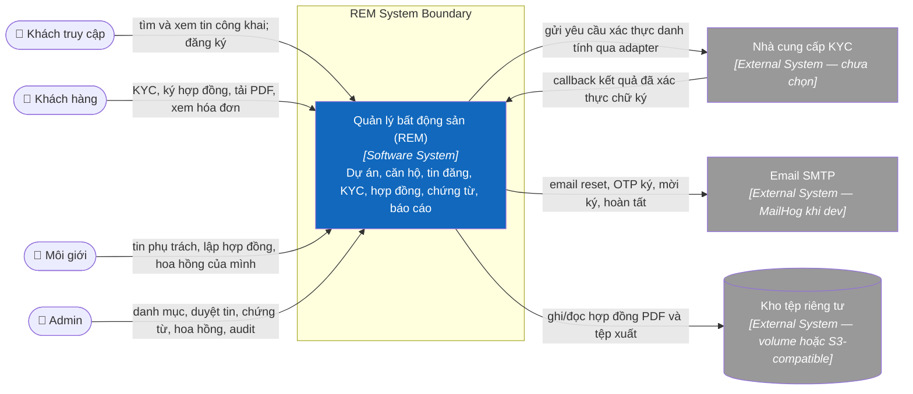
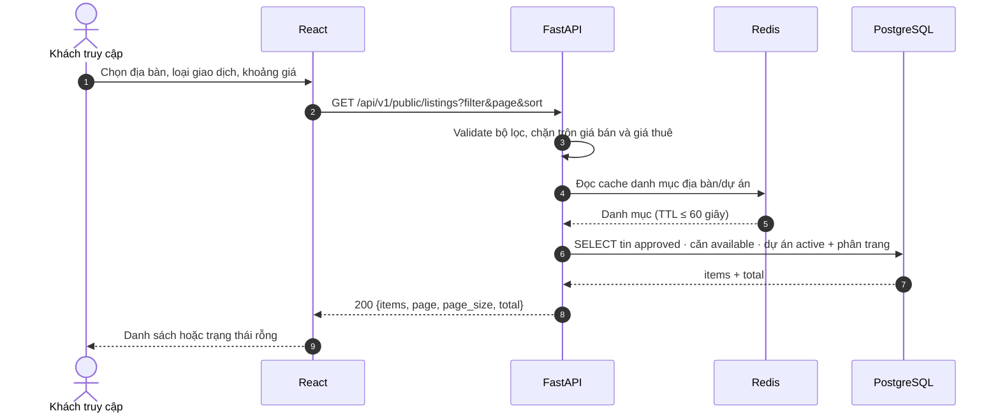
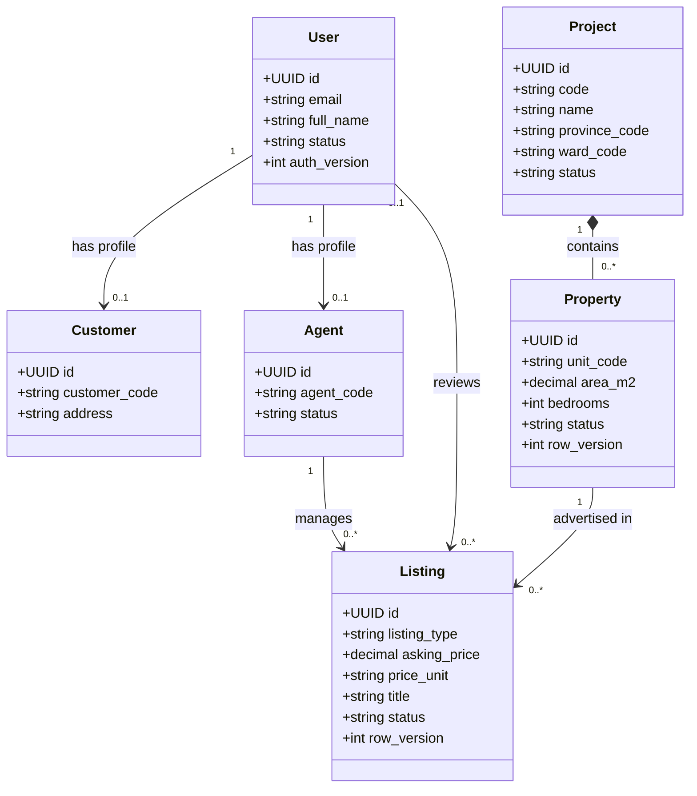
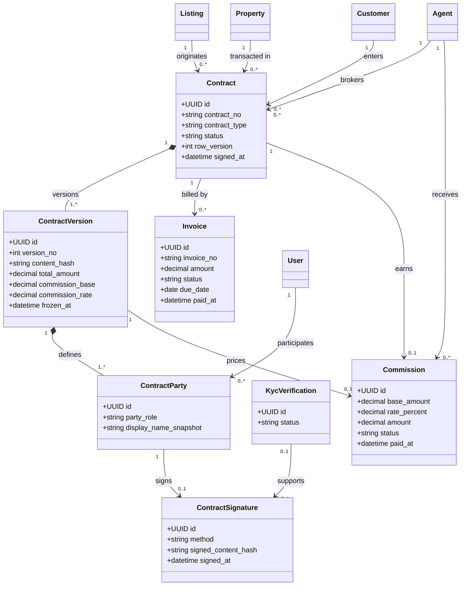

# Hệ thống quản lý bất động sản

Nền tảng quản lý dự án, căn hộ, tin bán/cho thuê, KYC, hợp đồng ký online, hoa hồng và hóa đơn cho một đơn vị kinh doanh bất động sản.

## Chạy nhanh

Yêu cầu: Docker Desktop (Compose v2), `make`, `python3` (chỉ để sinh secret).

```bash
# 1. Tạo file cấu hình rồi đặt JWT_SECRET_KEY
cp .env.example .env
python3 -c "import secrets; print(secrets.token_urlsafe(48))"   # dán vào JWT_SECRET_KEY trong .env

# 2. Dựng stack, tạo schema, nạp dữ liệu mẫu
make build
make up
make migrate
make seed
```


### Tài khoản demo

Mật khẩu chung: **`Demo@12345678`**

| Email | Vai trò |
| --- | --- |
| `admin@demo.com` | Admin — toàn quyền, kể cả `job.manage`, `kyc.read_sensitive` |
| `agent@demo.com` | Môi giới — quản lý tin của mình, xem khách trong giao dịch phụ trách |
| `customer@demo.com` | Khách hàng |


## Kiến trúc

### C4 Level 1 — System Context



### Sequence diagram — tìm kiếm tin công khai



### Class diagrams

Các sơ đồ dưới đây rút gọn các lớp miền và quan hệ canonical được mô tả trong
[ARCHITECTURE](docs/ARCHITECTURE.md) và [ERD](docs/ERD.md); chúng không thay thế
ERD đầy đủ cùng các ràng buộc cơ sở dữ liệu.

#### Tài khoản, dự án và tin đăng



#### Hợp đồng, ký và tài chính



Chi tiết C4 Level 2/3, các runtime scenario khác và quyết định kiến trúc nằm tại
[docs/ARCHITECTURE.md](docs/ARCHITECTURE.md).


## Cấu trúc thư mục

```text
.
├── docker-compose.yml          # postgres, redis, api, worker, frontend, nginx, mailhog
├── Makefile
├── .env.example                # cấu hình compose (cổng, JWT_SECRET_KEY)
├── infrastructure/nginx/       # reverse proxy
├── docs/                       # PRD, SPEC, ERD, USE_CASES, ARCHITECTURE, PLAN
└── src/
    ├── frontend/               # React 19 + Vite (chưa triển khai)
    └── backend/
        ├── app/
        │   ├── main.py         # app FastAPI, router, /health, /ready
        │   ├── core/           # config, bảo mật JWT, quyền, lỗi, cache, logging
        │   ├── common/         # micro ORM (db.py), enum, phân trang, helper tệp
        │   ├── middleware/     # request id, rate limit, audit, error handler
        │   ├── modules/        # mỗi domain: router, service, repository, schemas, permissions
        │   ├── integrations/   # adapter SMTP, kho tệp (KYC, PDF: chưa làm)
        │   └── workers/        # Celery app, dispatcher outbox, runner, email task
        ├── migrations/         # Alembic
        ├── scripts/seed.py
        └── tests/{unit,integration}/
```


## Tài liệu

| Tài liệu | Nội dung |
| --- | --- |
| [PRD](docs/PRD.md) | Phạm vi sản phẩm, vai trò, yêu cầu chức năng và phi chức năng |
| [SPEC](docs/SPEC.md) | Hành vi API, validation, transaction, mã lỗi, bộ test nghiệm thu T-01…T-13 |
| [ERD](docs/ERD.md) | 24 bảng, ràng buộc, chỉ mục |
| [USE_CASES](docs/USE_CASES.md) | Luồng sử dụng UC-01…UC-22 |
| [ARCHITECTURE](docs/ARCHITECTURE.md) | Kiến trúc C4, ADR, rủi ro |
| [PLAN](docs/PLAN.md) | Kế hoạch theo phase, gate và nhật ký thực hiện |
