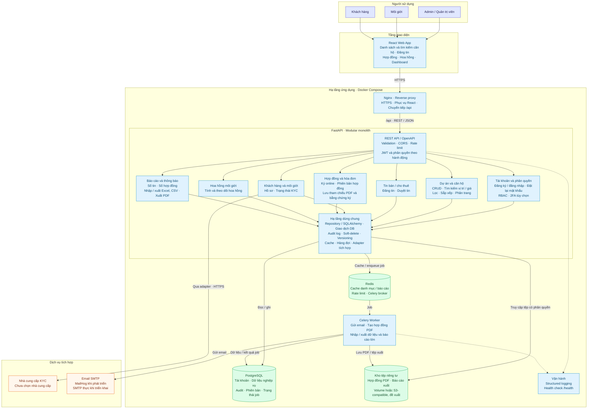
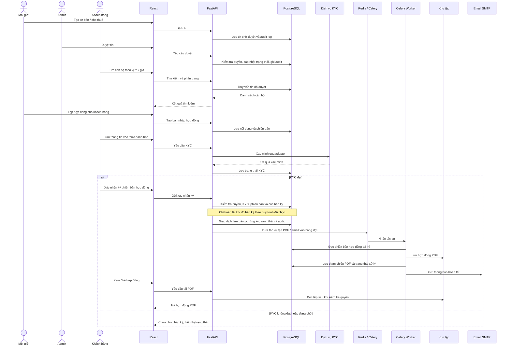

# Kiến trúc hệ thống quản lý bất động sản

Nguồn: [yeu_cau.pdf](yeu_cau.pdf), trang 1 (yêu cầu chung và bài toán Real Estate), trang 2 (tiêu chí chất lượng).

Đây là kiến trúc **đề xuất**, dựa trên yêu cầu và stack đã khai báo trong repository; không phải xác nhận các chức năng đã được triển khai. Chọn **modular monolith**: một ứng dụng FastAPI chia module nghiệp vụ, dùng chung PostgreSQL; Celery chạy riêng để xử lý tác vụ lâu.

## 1. Architecture diagram

Các mũi tên có nhãn biểu thị lời gọi hoặc hướng xử lý chính; phản hồi được lược bỏ. Các module bên trong FastAPI là ranh giới mã nguồn, không phải các microservice độc lập. Redis dùng chung hạ tầng nhưng cần tách namespace và chính sách lưu cache với hàng đợi để tránh mất job do eviction.

## 2. Luồng đăng tin → ký hợp đồng

Luồng trên đề xuất KYC trước khi ký. PDF không quy định phương thức ký (xác nhận điện tử, OTP hay nhà cung cấp chữ ký số), các bên bắt buộc ký, hoặc thời điểm ghi nhận hoa hồng; các quy tắc này cần chốt khi đặc tả chi tiết. Tạo PDF là bước xuất tài liệu, không thay thế việc xác nhận ký và lưu bằng chứng ký. Nếu dùng nhà cung cấp chữ ký điện tử, bổ sung adapter vào module hợp đồng.

## 3. Đối chiếu yêu cầu với thành phần

| Yêu cầu trong PDF | Thành phần xử lý |
| --- | --- |
| Đăng ký, đăng nhập, JWT/OAuth2, đặt lại mật khẩu; 2FA tùy chọn | Tài khoản, RBAC, worker gửi email; đề xuất JWT bearer theo luồng OAuth2 phù hợp |
| Ít nhất 3 vai trò; phân quyền màn hình và hành động | React kiểm soát hiển thị; FastAPI bắt buộc kiểm tra quyền và phạm vi dữ liệu |
| CRUD dự án, căn hộ; tìm theo vị trí, giá | Module dự án / căn hộ, PostgreSQL với chỉ mục phù hợp |
| Đăng tin bán / cho thuê, duyệt tin | Module tin đăng; đề xuất Admin duyệt tin |
| Ký hợp đồng online, lưu PDF, KYC | Module hợp đồng, hồ sơ KYC, adapter KYC, worker, kho tệp riêng tư |
| Hoa hồng môi giới | Module hoa hồng, liên kết môi giới và hợp đồng |
| Báo cáo số tin, số hợp đồng; dashboard | Module báo cáo, React, Redis cache |
| Nhập / xuất Excel, CSV; xuất PDF | API nhận yêu cầu, worker xử lý tác vụ lớn, kho tệp lưu kết quả |
| Audit log, soft-delete, versioning cơ bản | Hạ tầng dùng chung và PostgreSQL; audit lưu người thực hiện, thời điểm, hành động |
| Email và/hoặc in-app, hàng đợi tác vụ | Celery + Redis + SMTP; thông báo in-app có thể lưu trong PostgreSQL |
| Dữ liệu chính | `projects`, `properties`, `listings`, `contracts`, `customers`, `agents`, `invoices`; bổ sung bảng tài khoản, quyền, hoa hồng, KYC, audit, phiên bản và job |

PDF nêu vai trò chung Admin/Manager/User nhưng phần Real Estate chỉ định Admin/Môi giới/Khách hàng. Sơ đồ dùng ba vai trò nghiệp vụ này; quyền duyệt tin mặc định đề xuất giao cho Admin. Nếu cần Manager riêng, có thể bổ sung qua RBAC.

## 4. Bảo mật và vận hành

- Chống SQLi bằng truy vấn tham số hóa; kiểm tra và escape nội dung hiển thị để hạn chế XSS; CORS giới hạn origin; rate limit ở API. Nếu dùng cookie xác thực, bổ sung biện pháp CSRF. Phân quyền cả hành động lẫn từng bản ghi, đặc biệt hợp đồng và dữ liệu KYC.
- Kho tệp không công khai; tải qua API đã kiểm tra quyền hoặc URL ký có thời hạn. Chỉ lưu dữ liệu KYC cần thiết, không ghi giấy tờ định danh hoặc token vào log.
- Hợp đồng dùng kiểm tra phiên bản để tránh ghi đè đồng thời. Job cần retry, xử lý idempotent và lưu trạng thái bền vững; trạng thái hợp đồng đã ký phải được đối soát để khôi phục tác vụ nếu enqueue thất bại.
- Docker Compose đề xuất gồm Nginx/React, API, PostgreSQL, Redis, Celery worker, MailHog cho phát triển và volume lưu tệp. Tên dịch vụ trong sơ đồ không khẳng định cấu hình Compose hiện tại đã hoàn chỉnh.
- CI/CD: build → unit test service và integration test API (coverage tối thiểu 30–40% theo tài liệu) → đóng gói image → deploy; migration bằng Alembic và seed ít nhất 2.000 bản ghi mẫu.
- Structured logging, `/health`, OpenAPI/Swagger và Postman collection phục vụ kiểm thử, bàn giao; không ghi bí mật vào log. Chuẩn bị mẫu hợp đồng, dashboard và video demo theo PDF.

## 5. Cơ sở lựa chọn công nghệ

React, FastAPI, PostgreSQL, Redis, Celery và Docker đã xuất hiện trong README, dependency manifest hoặc Docker Compose của repository. Nginx có thư mục cấu hình. Kho tệp riêng tư, adapter KYC, phương thức ký, SMTP khi triển khai và các chính sách bảo mật là phần thiết kế đề xuất để đáp ứng yêu cầu; tài liệu không chỉ định nhà cung cấp.
