# Architecture (arc42 + C4)

## 1. Introduction and Goals

Hệ thống quản lý bất động sản (REM) quản lý tập trung dự án, căn hộ, tin bán/cho thuê, hồ sơ khách hàng/môi giới, xác thực KYC, hợp đồng ký online, hóa đơn nội bộ và hoa hồng môi giới, kèm dashboard số tin/số hợp đồng. Phạm vi nghiệp vụ, giả định và tiêu chí nghiệm thu do [PRD](PRD.md) quy định; hành vi API và transaction do [SPEC](SPEC.md) quy định; bảng và ràng buộc dữ liệu do [ERD](ERD.md) quy định; tương tác người dùng do [USE_CASES](USE_CASES.md) quy định.

Mục tiêu kiến trúc là giữ mọi business rule và quyết định quyền ở backend, giữ PostgreSQL làm system of record cho cả dữ liệu nghiệp vụ và trạng thái tác vụ nền, cô lập nhà cung cấp ngoài (KYC, SMTP, kho tệp) qua adapter, và cho phép làm từng vertical slice mà không biến cây file skeleton thành nguồn business rule.

Backend được triển khai thành **5 microservice theo bounded context cộng một API gateway**, chung một PostgreSQL với mỗi service một schema ([ADR-011](adr/ADR-011-microservice-decomposition.md)). Ranh giới sở hữu dữ liệu ở mục 5.5 vì thế được ép ở mức tiến trình, không chỉ bằng quy ước thư mục.

### 1.1 Stakeholders

| Role | Concern |
|---|---|
| Giảng viên hướng dẫn / người chấm | nghiệp vụ cốt lõi chạy được, tài liệu và demo khớp mã nguồn, có bằng chứng kiểm thử |
| Admin / quản trị viên nghiệp vụ | duyệt tin đúng thẩm quyền, quản lý danh mục, chứng từ, hoa hồng và truy vết quyết định |
| Môi giới | tin và hợp đồng mình phụ trách, hoa hồng của mình, báo cáo trong phạm vi |
| Khách hàng | tìm căn phù hợp, KYC, xem và ký hợp đồng, tải hợp đồng PDF, xem hóa đơn của mình |
| Khách truy cập | tìm kiếm tin công khai mà không cần đăng nhập |
| Application engineer | contract API rõ, module độc lập, môi trường dev tái lập được bằng Docker Compose |
| Architect / reviewer | ngăn drift giữa PRD/SPEC/ERD, OpenAPI và implementation |
| Security / dữ liệu cá nhân | least privilege, tệp riêng tư, audit, không lộ KYC/OTP/token |
| Operations (vai trò kiêm nhiệm) | migration, seed, log có cấu trúc, health check, phục hồi job sau lỗi |

### 1.2 Quality goals (measurable — arc42 §1.2)

| # | Quality goal | Scenario | Measure | Priority |
|---|---|---|---|---|
| Q1 | **Phân quyền theo hành động và bản ghi** | người dùng gọi API ngoài vai trò hoặc dùng UUID của người khác | 100% API nghiệp vụ yêu cầu actor đã xác thực; test ngoài quyền trả `401/403/404`; khách không nhận `internal_terms`, hoa hồng hay KYC thô | 1 |
| Q2 | **Toàn vẹn giao dịch và truy vết** | lỗi xảy ra giữa luồng gửi ký, ký, ghi nhận tiền | rollback không để trạng thái dở dang (không có căn `reserved` khi hợp đồng còn `draft`); 100% lệnh nhạy cảm ghi audit cùng transaction | 1 |
| Q3 | **Đúng máy trạng thái** | client gửi transition sai hoặc `row_version` cũ | transition ngoài [PRD §5.1](PRD.md) bị từ chối; xung đột phiên bản trả `409`; client không sửa trực tiếp `status`, `signed_at`, `paid_at` | 1 |
| Q4 | **Không lộ dữ liệu nhạy cảm** | ghi log, xuất Excel/CSV/PDF, tải tệp | không log mật khẩu/token/OTP/giấy tờ KYC; tệp riêng tư chỉ tải qua API đã kiểm tra quyền; ô công thức được xuất dạng text | 1 |
| Q5 | **Idempotency và phục hồi tích hợp** | gửi lại lệnh ký/duyệt/chi, job lặp, SMTP/storage timeout | một hợp đồng sinh đúng một `commissions` và một job PDF; retry không tạo side effect lần hai; outbox phát lại được sau khi Redis lỗi | 2 |
| Q6 | **Hiệu năng đọc** | tải danh sách/tìm kiếm có filter và phân trang | p95 ≤ 2 giây với ≥ 2.000 bản ghi mẫu và 20 người dùng đồng thời, không tính thời gian nhà cung cấp ngoài ([NFR-04](PRD.md)) | 2 |
| Q7 | **Dễ bảo trì theo module** | thêm module hoặc thay adapter nhà cung cấp | không sửa module không liên quan; module không import internals của module khác; chiều phụ thuộc router → service → repository | 2 |
| Q8 | **Bàn giao kiểm chứng được** | nghiệm thu bài tập lớn | coverage backend ≥ 40% line (yêu cầu gốc 30–40%); OpenAPI + Postman; Compose chạy được kèm migration và seed ≥ 2.000 bản ghi | 2 |

Q1–Q4 là các mục tiêu định hình kiến trúc. Mọi quyết định làm suy giảm chúng phải có ADR riêng.

---

## 2. Constraints

Quy ước nhãn trạng thái dùng xuyên suốt tài liệu: **Implemented** = có mã nguồn chạy được và có test; **Skeleton** = file/dịch vụ đã tồn tại nhưng rỗng hoặc chưa có hành vi; **Proposed** = thiết kế, chưa có trong repository.

| # | Constraint | Type | Implication |
|---|---|---|---|
| C1 | Sau [PLAN](PLAN.md) Phase 0–1 và đợt tách service: hạ tầng, 24 model (đã chia về 5 service), 5 migration, seed và test invariant là Implemented; toàn bộ `router/service/repository/schemas/permissions` của 15 module vẫn **rỗng** | Project | mô tả use case và API trong tài liệu này là thiết kế mục tiêu, chỉ phần nêu rõ Implemented mới có hành vi thật |
| C2 | Frontend không truy cập PostgreSQL/Redis trực tiếp | Security | mọi query/command đi qua FastAPI và kiểm tra quyền phía server |
| C3 | Stack đã cố định trong repository: FastAPI + SQLAlchemy async + PostgreSQL 16 + Redis 7 (rate limit, cache, event stream) + Celery + React 19/Vite + Nginx + Docker Compose | Technical | không thay stack mà không có ADR; phiên bản đã pin ở `src/backend/requirements/base.txt` dùng chung cho mọi service |
| C4 | PostgreSQL là system of record; [ERD](ERD.md) là canonical schema contract. Một database, mỗi service một schema, FK liên schema được giữ ([ADR-011](adr/ADR-011-microservice-decomposition.md)) | Technical | mỗi service có `alembic.ini` và bảng `alembic_version` riêng; thứ tự áp migration (identity → platform → crm → catalog → transaction) là ràng buộc vận hành, sai thứ tự thì FK liên schema không tạo được |
| C5 | Không dùng distributed transaction — với nhà cung cấp ngoài **và giữa các service** | Technical | commit trạng thái nghiệp vụ trước, side effect đi qua `jobs`/`outbox_events` (job nền) và `event_outbox` → Redis Streams (sự kiện liên service), đều kèm idempotency và đối soát |
| C6 | Dữ liệu KYC, nội dung hợp đồng, hoa hồng và hóa đơn là dữ liệu nhạy cảm | Legal/Security | least privilege, kho tệp riêng tư, redaction log, không lưu OTP thô |
| C7 | Phạm vi MVP bị chốt bởi giả định A-01…A-08 của [PRD](PRD.md): ba vai trò, hai bên ký, KYC trước ký, OTP email, VND, hóa đơn nội bộ | Product | không thêm thanh toán online, chữ ký số nhà cung cấp, thuê nhiều kỳ hay 2FA đăng nhập vào MVP |
| C8 | Giao diện tiếng Việt, hiển thị giờ `Asia/Ho_Chi_Minh`, tiền VND | Product | bộ lọc ngày quy đổi sang UTC ở server; thuật ngữ trạng thái phải khớp PRD/SPEC |
| C9 | Documentation-first | Organisational | đổi nghiệp vụ phải cập nhật đồng thời PRD, SPEC, ERD, USE_CASES và tài liệu này |
| C10 | Đây là bài tập lớn: chưa có SLA, hosting, domain/HTTPS thật, RPO/RTO; CI hiện chỉ là workflow placeholder | Organisational | thiết kế triển khai giữ vendor-neutral, không cam kết production |

---

## 3. Context and Scope

<a id="c4-level-1-system-context"></a>

### 3.1 Business context (C4 Level 1)

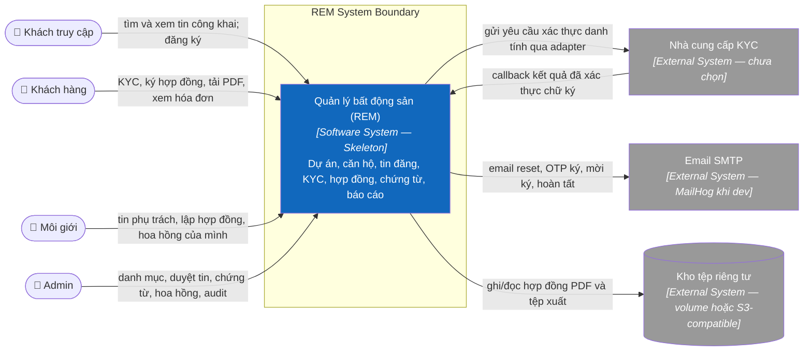
```mermaid
flowchart LR
    guest(["👤 Khách truy cập"])
    customer(["👤 Khách hàng"])
    agent(["👤 Môi giới"])
    admin(["👤 Admin"])

    subgraph boundary["REM System Boundary"]
        rem["Quản lý bất động sản (REM)<br/><i>[Software System — Skeleton]</i><br/>Dự án, căn hộ, tin đăng, KYC, hợp đồng, chứng từ, báo cáo"]
    end

    kyc["Nhà cung cấp KYC<br/><i>[External System — chưa chọn]</i>"]
    mail["Email SMTP<br/><i>[External System — MailHog khi dev]</i>"]
    store[("Kho tệp riêng tư<br/><i>[External System — volume hoặc S3-compatible]</i>")]

    guest -- "tìm và xem tin công khai; đăng ký" --> rem
    customer -- "KYC, ký hợp đồng, tải PDF, xem hóa đơn" --> rem
    agent -- "tin phụ trách, lập hợp đồng, hoa hồng của mình" --> rem
    admin -- "danh mục, duyệt tin, chứng từ, hoa hồng, audit" --> rem
    rem -- "gửi yêu cầu xác thực danh tính qua adapter" --> kyc
    kyc -- "callback kết quả đã xác thực chữ ký" --> rem
    rem -- "email reset, OTP ký, mời ký, hoàn tất" --> mail
    rem -- "ghi/đọc hợp đồng PDF và tệp xuất" --> store

    style rem fill:#1168bd,color:#fff
    style kyc fill:#999,color:#fff
    style mail fill:#999,color:#fff
    style store fill:#999,color:#fff
```

Không có Identity Provider ngoài: MVP tự quản lý tài khoản và phát JWT ([SP-01](SPEC.md)). Thông báo in-app là mở rộng tùy chọn, không thuộc context hiện tại.

### 3.2 External interfaces

| Interface | Direction | Protocol / contract | Contract owner | Failure mode |
|---|---|---|---|---|
| Web API | in/out | HTTPS, REST/JSON, OpenAPI sinh từ FastAPI | Backend API | envelope `{error:{code,message,details}, request_id}`, `Retry-After` khi `429` |
| KYC provider | both | HTTPS qua adapter + callback có chữ ký/secret, chống replay | Module KYC | timeout giữ `pending` để đối soát, hết cửa sổ thì `failed`; không bao giờ tự thành `verified` |
| Email SMTP | out | SMTP qua adapter, mỗi email một job/một recipient | Worker + module notifications | retry hữu hạn, lưu `email_deliveries`; SMTP timeout có thể gây email lặp, không hứa exactly-once |
| Kho tệp riêng tư | both | object/volume API, chỉ tải qua API đã kiểm tra quyền | Adapter file storage | lỗi storage không làm mất chữ ký/hợp đồng; job `failed` cho phép thử lại |
| PostgreSQL | both | protocol PostgreSQL qua SQLAlchemy async | Data layer | rollback toàn bộ; readiness degraded |
| Redis | both | rate limit, cache danh mục/báo cáo, Celery broker | Core + worker | route nhạy cảm fail closed `503`; route thường fail open; broker lỗi thì outbox phát lại |

---

## 4. Solution Strategy

| Quality goal | Strategy | Where |
|---|---|---|
| Q1 phân quyền | xác thực JWT ở pipeline, permission theo hành động + scope bản ghi ở service, DTO theo allowlist trường | §5.3, §8, ADR-003 |
| Q2 toàn vẹn | service sở hữu transaction boundary; ràng buộc + partial unique index ở DB; `row_version` optimistic lock; audit cùng transaction | §5.3, §6.3, ADR-002/006 |
| Q3 máy trạng thái | endpoint dạng lệnh (`/submit`, `/approve`, `/send-for-signing`, `/sign`, `/pay`), không cho PATCH `status` | §6, §8, ADR-005 |
| Q4 dữ liệu nhạy cảm | snapshot `signed_document` tách `internal_terms`, kho tệp riêng tư, redaction ở logging, không lưu OTP thô | §5.3, §8, ADR-008 |
| Q5 idempotency | `jobs.idempotency_key` + `outbox_events.event_key`, khóa mẫu theo nghiệp vụ, đối soát job treo | §5.4, §6.5, ADR-007 |
| Q6 hiệu năng | filter/sort/page phía server, chỉ mục theo truy vấn của [ERD §7](ERD.md), cache danh mục/báo cáo TTL ≤ 60 giây | §8, §10 |
| Q7 bảo trì | 5 service theo bounded context, trong mỗi service là `<pkg>/modules/<domain>/` với phụ thuộc một chiều router → service → repository, adapter cho nhà cung cấp | §5.3, §5.5, [ADR-011](adr/ADR-011-microservice-decomposition.md) |
| Q8 bàn giao | Compose chạy được, Alembic migration, seed ≥ 2.000 bản ghi, CI build → test → coverage gate | §7, §12, ADR-002 |

**The one-sentence strategy:** *một modular monolith FastAPI giữ toàn bộ business rule và transaction, PostgreSQL làm system of record cho cả dữ liệu nghiệp vụ và trạng thái job, Celery chỉ chạy việc đã được commit, mọi hệ thống ngoài đi qua adapter.*

### 4.1 Strategy in one picture

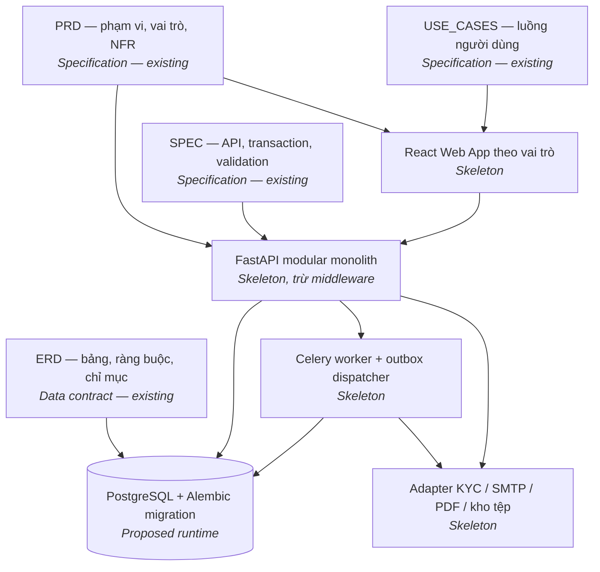
```mermaid
flowchart TB
    PRD["PRD — phạm vi, vai trò, NFR<br/><i>Specification — existing</i>"]
    SPECDOC["SPEC — API, transaction, validation<br/><i>Specification — existing</i>"]
    ERDDOC["ERD — bảng, ràng buộc, chỉ mục<br/><i>Data contract — existing</i>"]
    UC["USE_CASES — luồng người dùng<br/><i>Specification — existing</i>"]
    Web["React Web App theo vai trò<br/><i>Skeleton</i>"]
    API["FastAPI modular monolith<br/><i>Skeleton, trừ middleware</i>"]
    DB[("PostgreSQL + Alembic migration<br/><i>Proposed runtime</i>")]
    Worker["Celery worker + outbox dispatcher<br/><i>Skeleton</i>"]
    Adapters["Adapter KYC / SMTP / PDF / kho tệp<br/><i>Skeleton</i>"]

    PRD --> Web
    UC --> Web
    PRD --> API
    SPECDOC --> API
    ERDDOC --> DB
    Web --> API
    API --> DB
    API --> Worker
    Worker --> DB
    Worker --> Adapters
    API --> Adapters
```

---

## 5. Building Block View

<a id="c4-level-2-containers"></a>

### 5.1 C4 Level 2 — containers

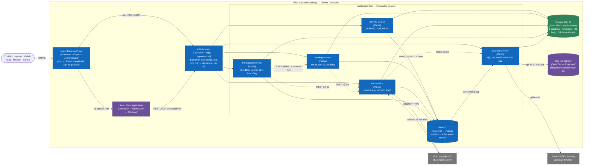
```mermaid
flowchart LR
    users(["👤 Khách truy cập · Khách hàng · Môi giới · Admin"])

    subgraph system["REM System Boundary — Docker Compose"]
        direction TB
        proxy["Nginx Reverse Proxy<br/><i>[Container · Edge — Implemented]</i><br/>phục vụ React, chuyển tiếp /api tới gateway"]
        web["React Web Application<br/><i>[Container · Presentation — Skeleton]</i>"]
        gw["API Gateway<br/><i>[Container · Edge — Implemented]</i><br/>định tuyến theo tiền tố, rate limit biên, chặn header nội bộ"]

        subgraph svc["Application Tier — 5 bounded context"]
            direction TB
            identity["identity-service<br/><i>[Partial]</i><br/>tài khoản, JWT, RBAC"]
            catalog["catalog-service<br/><i>[Partial]</i><br/>dự án, căn hộ, tin đăng"]
            crm["crm-service<br/><i>[Partial]</i><br/>khách hàng, môi giới, KYC"]
            txn["transaction-service<br/><i>[Partial]</i><br/>hợp đồng, ký, hóa đơn, hoa hồng"]
            plat["platform-service<br/><i>[Partial]</i><br/>tệp, job, email, audit, báo cáo"]
        end

        db[("PostgreSQL 16<br/><i>[Data Tier — Implemented]</i><br/>1 database · 5 schema · 29 bảng · 5 lịch sử Alembic")]
        redis[("Redis 7<br/><i>[Data Tier — Partial]</i><br/>rate limit, cache, event stream")]
        store[("Kho tệp riêng tư<br/><i>[Data Tier — Proposed]</i><br/>chỉ platform-service chạm tới")]
    end

    kyc["Nhà cung cấp KYC<br/><i>[External System]</i>"]
    mail["Email SMTP / MailHog<br/><i>[External System]</i>"]

    users -->|HTTPS| proxy
    proxy -->|"tài nguyên tĩnh"| web
    proxy -->|"/api · REST/JSON"| gw
    web -->|"REST/JSON theo OpenAPI"| gw

    gw --> identity
    gw --> catalog
    gw --> crm
    gw --> txn
    gw --> plat

    identity --> db
    catalog --> db
    crm --> db
    txn --> db
    plat --> db

    txn -.->|"REST nội bộ · X-Internal-Key"| catalog
    txn -.->|"REST nội bộ"| crm
    catalog -.->|"REST nội bộ"| crm
    crm -.->|"REST nội bộ"| plat

    identity -->|"event_outbox → stream"| redis
    catalog --> redis
    crm --> redis
    txn --> redis
    redis -->|"consumer group"| plat

    plat -->|"ghi PDF, tệp xuất"| store
    crm -->|"adapter HTTPS"| kyc
    kyc -->|"callback đã xác thực"| crm
    plat -->|"gửi email"| mail

    classDef partial fill:#1168bd,color:#fff,stroke:#0b4884
    classDef skeleton fill:#6b4f9b,color:#fff,stroke:#463267
    classDef contract fill:#2f855a,color:#fff,stroke:#1f5b3d
    classDef external fill:#777,color:#fff,stroke:#555
    class identity,catalog,crm,txn,plat,redis,gw,proxy partial
    class web,store skeleton
    class db contract
    class kyc,mail external
```

Nét liền là phụ thuộc đồng bộ (client phải chờ), nét đứt là lời gọi nội bộ giữa
service, mũi tên qua Redis là sự kiện bất đồng bộ.

**Container responsibilities and dependency direction**

```text
Presentation        Edge                 Application Tier                    Data Tier
React Web App  →  Nginx  →  API Gateway  ─┬→ identity-service  ─┐
                                          ├→ catalog-service   ─┤
                                          ├→ crm-service       ─┼→ PostgreSQL (5 schema)
                                          ├→ transaction-service┤
                                          └→ platform-service  ─┘
                                             │
                             event_outbox ──→ Redis Streams ──→ consumer group của service nghe
```

- **Nginx:** điểm vào duy nhất từ bên ngoài. Chỉ biết một upstream backend là gateway; trả `404` cho `/internal`. TLS chưa cấu hình vì chưa có domain.
- **React Web Application:** hiển thị, điều hướng, trạng thái UI; không phải security boundary.
- **API Gateway:** định tuyến theo tiền tố tài nguyên (`api_gateway/routing.py`), rate limit ở biên — nơi duy nhất còn thấy IP thật của client — và **chặn `X-Internal-Key` đi từ ngoài vào**. Không chứa business rule; nếu gateway bắt đầu "biết" nghiệp vụ thì nó đã thành monolith mới.
- **Năm service nghiệp vụ:** mỗi service sở hữu đúng một schema và là nơi duy nhất ghi vào bảng của schema đó. Xác thực JWT, kiểm tra permission + scope, thực thi use case, giữ transaction boundary và ghi audit đều nằm trong service sở hữu.
- **PostgreSQL:** system of record. Một database, 5 schema, FK liên schema được giữ làm lớp chặn cuối; mỗi schema có bảng `alembic_version` riêng.
- **Redis:** rate limit (đã có), event stream cho sự kiện miền, cache danh mục/báo cáo (đề xuất). Tách namespace giữa ba mục đích để không mất sự kiện.
- **Kho tệp riêng tư:** chỉ mount vào platform-service; service khác xin URL tải qua API của nó chứ không đọc thẳng đĩa.
- Xanh dương là Partial, tím là Skeleton, xanh lá là contract dữ liệu, xám là hệ thống ngoài.

<a id="c4-level-3-web"></a>

### 5.2 C4 Level 3 — inside React Web Application

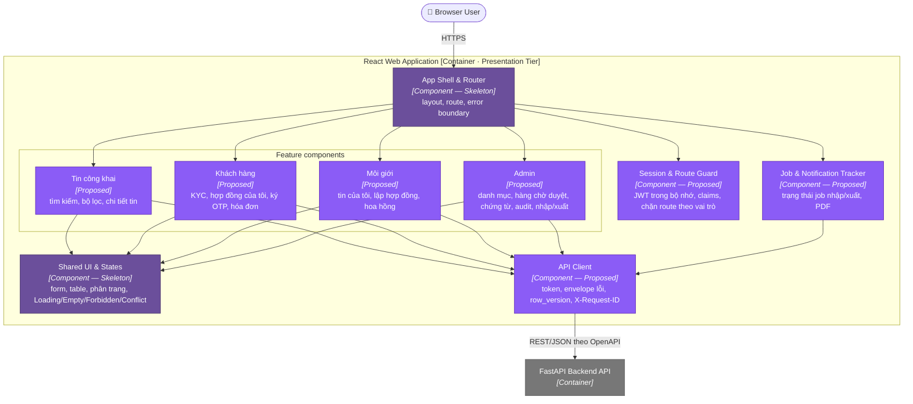
```mermaid
flowchart TB
    user(["👤 Browser User"])
    api["FastAPI Backend API<br/><i>[Container]</i>"]

    subgraph web["React Web Application [Container · Presentation Tier]"]
        direction TB
        shell["App Shell & Router<br/><i>[Component — Skeleton]</i><br/>layout, route, error boundary"]
        session["Session & Route Guard<br/><i>[Component — Proposed]</i><br/>JWT trong bộ nhớ, claims, chặn route theo vai trò"]

        subgraph features["Feature components"]
            direction LR
            publicUi["Tin công khai<br/><i>[Proposed]</i><br/>tìm kiếm, bộ lọc, chi tiết tin"]
            customerUi["Khách hàng<br/><i>[Proposed]</i><br/>KYC, hợp đồng của tôi, ký OTP, hóa đơn"]
            agentUi["Môi giới<br/><i>[Proposed]</i><br/>tin của tôi, lập hợp đồng, hoa hồng"]
            adminUi["Admin<br/><i>[Proposed]</i><br/>danh mục, hàng chờ duyệt, chứng từ, audit, nhập/xuất"]
        end

        shared["Shared UI & States<br/><i>[Component — Skeleton]</i><br/>form, table, phân trang, Loading/Empty/Forbidden/Conflict"]
        client["API Client<br/><i>[Component — Proposed]</i><br/>token, envelope lỗi, row_version, X-Request-ID"]
        jobsUi["Job & Notification Tracker<br/><i>[Component — Proposed]</i><br/>trạng thái job nhập/xuất, PDF"]

        shell --> session
        shell --> publicUi
        shell --> customerUi
        shell --> agentUi
        shell --> adminUi
        publicUi --> shared
        customerUi --> shared
        agentUi --> shared
        adminUi --> shared
        publicUi --> client
        customerUi --> client
        agentUi --> client
        adminUi --> client
        shell --> jobsUi
        jobsUi --> client
    end

    user -->|HTTPS| shell
    client -->|"REST/JSON theo OpenAPI"| api

    classDef skeleton fill:#6b4f9b,color:#fff,stroke:#463267
    classDef proposed fill:#8b5cf6,color:#fff,stroke:#5b21b6
    classDef external fill:#777,color:#fff,stroke:#555
    class shell,shared skeleton
    class session,publicUi,customerUi,agentUi,adminUi,client,jobsUi proposed
    class api external
```

`src/frontend/` hiện là template Vite mặc định (`App.jsx` đếm số), chưa có router, chưa có API client, chưa có feature nào. Mỗi feature chỉ được phụ thuộc `shared` và `client`; không import internals của feature khác. Route guard chỉ phục vụ trải nghiệm — backend vẫn phải kiểm tra quyền cho mọi request, kể cả khi UI đã ẩn nút.

<a id="c4-level-3-backend"></a>

### 5.3 C4 Level 3 — inside một service nghiệp vụ

Sơ đồ dưới đây mô tả cấu trúc **bên trong một service**, giống nhau ở cả năm:
`rem_shared` cung cấp pipeline HTTP, phiên database và hợp đồng lỗi; phần riêng
của service là các module nghiệp vụ. Chiều phụ thuộc trong một module vẫn là
router → service → repository → model.

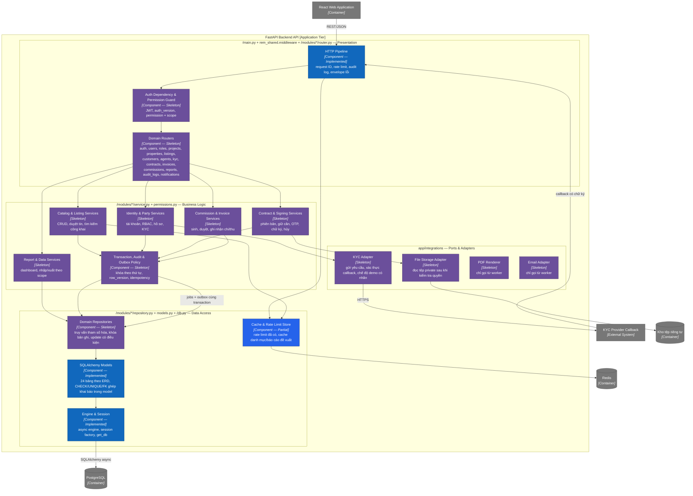
```mermaid
flowchart TB
    web["React Web Application<br/><i>[Container]</i>"]
    callbacks["KYC Provider Callback<br/><i>[External System]</i>"]
    db[("PostgreSQL<br/><i>[Container]</i>")]
    redis[("Redis<br/><i>[Container]</i>")]
    store[("Kho tệp riêng tư<br/><i>[Container]</i>")]

    subgraph api["FastAPI Backend API [Application Tier]"]
        direction TB

        subgraph presentation["<pkg>/main.py + rem_shared.middleware + <pkg>/modules/*/router.py — Presentation"]
            direction LR
            pipeline["HTTP Pipeline<br/><i>[Component — Implemented]</i><br/>request ID, rate limit, audit log, envelope lỗi"]
            authz["Auth Dependency & Permission Guard<br/><i>[Component — Skeleton]</i><br/>JWT, auth_version, permission + scope"]
            routers["Domain Routers<br/><i>[Component — Skeleton]</i><br/>auth, users, roles, projects, properties, listings,<br/>customers, agents, kyc, contracts, invoices,<br/>commissions, reports, audit_logs, notifications"]
        end

        subgraph business["<pkg>/modules/*/service.py + permissions.py — Business Logic"]
            direction LR
            catalogSvc["Catalog & Listing Services<br/><i>[Skeleton]</i><br/>CRUD, duyệt tin, tìm kiếm công khai"]
            partySvc["Identity & Party Services<br/><i>[Skeleton]</i><br/>tài khoản, RBAC, hồ sơ, KYC"]
            contractSvc["Contract & Signing Services<br/><i>[Skeleton]</i><br/>phiên bản, giữ căn, OTP, chữ ký, hủy"]
            moneySvc["Commission & Invoice Services<br/><i>[Skeleton]</i><br/>sinh, duyệt, ghi nhận chi/thu"]
            reportSvc["Report & Data Services<br/><i>[Skeleton]</i><br/>dashboard, nhập/xuất theo scope"]
            txPolicy["Transaction, Audit & Outbox Policy<br/><i>[Component — Skeleton]</i><br/>khóa theo thứ tự, row_version, idempotency"]
        end

        subgraph data["<pkg>/modules/*/repository.py + models.py + <pkg>/db.py — Data Access"]
            direction LR
            repos["Domain Repositories<br/><i>[Component — Skeleton]</i><br/>truy vấn tham số hóa, khóa bản ghi, update có điều kiện"]
            models["SQLAlchemy Models<br/><i>[Component — Implemented]</i><br/>24 bảng theo ERD, CHECK/UNIQUE/FK ghép khai báo trong model"]
            session["Engine & Session<br/><i>[Component — Implemented]</i><br/>async engine, session factory, get_db"]
            cache["Cache & Rate Limit Store<br/><i>[Component — Partial]</i><br/>rate limit đã có, cache danh mục/báo cáo đề xuất"]
        end

        subgraph adapters["app/integrations — Ports & Adapters"]
            direction TB
            kycAdapter["KYC Adapter<br/><i>[Skeleton]</i><br/>gửi yêu cầu, xác thực callback, chế độ demo có nhãn"]
            fileAdapter["File Storage Adapter<br/><i>[Skeleton]</i><br/>đọc tệp private sau khi kiểm tra quyền"]
            pdfAdapter["PDF Renderer<br/><i>[Skeleton]</i><br/>chỉ gọi từ worker"]
            mailAdapter["Email Adapter<br/><i>[Skeleton]</i><br/>chỉ gọi từ worker"]
        end
    end

    web -->|"REST/JSON"| pipeline
    callbacks -->|"callback có chữ ký"| pipeline
    pipeline --> authz
    authz --> routers
    routers --> catalogSvc
    routers --> partySvc
    routers --> contractSvc
    routers --> moneySvc
    routers --> reportSvc
    catalogSvc --> txPolicy
    partySvc --> txPolicy
    contractSvc --> txPolicy
    moneySvc --> txPolicy
    reportSvc --> repos
    txPolicy --> repos
    repos --> models
    models --> session
    session -->|"SQLAlchemy async"| db
    pipeline --> cache
    catalogSvc --> cache
    cache --> redis
    txPolicy -->|"jobs + outbox cùng transaction"| repos
    partySvc --> kycAdapter
    contractSvc --> fileAdapter
    kycAdapter -->|HTTPS| callbacks
    fileAdapter --> store

    classDef implemented fill:#1168bd,color:#fff,stroke:#0b4884
    classDef skeleton fill:#6b4f9b,color:#fff,stroke:#463267
    classDef partial fill:#2563eb,color:#fff,stroke:#1e3a8a
    classDef external fill:#777,color:#fff,stroke:#555
    class pipeline,session,models implemented
    class cache partial
    class authz,routers,catalogSvc,partySvc,contractSvc,moneySvc,reportSvc,txPolicy,repos,kycAdapter,fileAdapter,pdfAdapter,mailAdapter skeleton
    class web,callbacks,db,redis,store external
```

Ba **tier runtime** là Presentation (React sau Nginx), Application (gateway + 5 service + tiến trình nền) và Data (PostgreSQL, Redis, kho tệp). Gateway và worker không tạo tier thứ tư. Ba **layer mã nguồn** bên trong mỗi service, theo đúng cây file `<pkg>/modules/<domain>/`:

- `router.py` chỉ chuyển HTTP contract thành lệnh/truy vấn, gọi service và map kết quả sang `schemas.py`; không chứa business rule.
- `service.py` + `permissions.py` sở hữu use case, kiểm tra permission theo hành động và scope bản ghi, mở transaction, ghi audit và tạo `jobs`/`outbox_events`; không phụ thuộc FastAPI.
- `repository.py` + `models.py` là nơi duy nhất chạm SQL; truy vấn tham số hóa, khóa bản ghi theo thứ tự thống nhất (căn → tin → hợp đồng → khách → party/challenge) và update có điều kiện theo `row_version`.
- `app/integrations/*` là adapter nhà cung cấp; service chỉ phụ thuộc interface, không phụ thuộc SDK. Không gọi adapter bên trong transaction đang giữ khóa DB. API chỉ gọi trực tiếp adapter KYC và adapter kho tệp (khi trả tệp đã kiểm tra quyền); SMTP và PDF luôn đi qua worker theo [SP-04/SP-07](SPEC.md), nên hai adapter đó chỉ được gọi từ container worker ở §5.4.
- Phần Implemented hiện nay: pipeline HTTP (request ID, rate limit fail-closed cho route nhạy cảm, audit log không chứa body, envelope lỗi `{error:{code,message,details}, request_id}`) và engine/session async. Toàn bộ router/service/repository/model còn rỗng.

<a id="c4-level-3-worker"></a>

### 5.4 C4 Level 3 — inside tiến trình nền

Sau khi tách service, mỗi service có tiến trình nền riêng và chúng chạy sau
profile `workers` của Compose:

- `python -m <pkg>.workers.outbox` — dispatcher đẩy `event_outbox` sang Redis
  Streams. **Mọi service đều có**, vì service nào cũng có thể phát sự kiện.
- `python -m <pkg>.workers.events` — consumer group đọc stream của context mà
  service đó nghe. Chỉ service có người nghe mới có (hiện tại: platform-service).
- Celery vẫn dùng cho job nặng có trạng thái trong bảng `jobs` (PDF, nhập/xuất),
  thuộc platform-service và transaction-service.

Sơ đồ dưới là luồng job nền của platform-service.

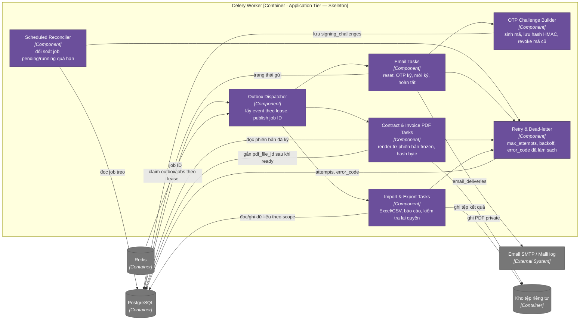
```mermaid
flowchart LR
    db[("PostgreSQL<br/><i>[Container]</i>")]
    redis[("Redis<br/><i>[Container]</i>")]
    mail["Email SMTP / MailHog<br/><i>[External System]</i>"]
    store[("Kho tệp riêng tư<br/><i>[Container]</i>")]

    subgraph worker["Celery Worker [Container · Application Tier — Skeleton]"]
        direction TB
        dispatcher["Outbox Dispatcher<br/><i>[Component]</i><br/>lấy event theo lease, publish job ID"]
        beat["Scheduled Reconciler<br/><i>[Component]</i><br/>đối soát job pending/running quá hạn"]
        emailTask["Email Tasks<br/><i>[Component]</i><br/>reset, OTP ký, mời ký, hoàn tất"]
        otp["OTP Challenge Builder<br/><i>[Component]</i><br/>sinh mã, lưu hash HMAC, revoke mã cũ"]
        pdfTask["Contract & Invoice PDF Tasks<br/><i>[Component]</i><br/>render từ phiên bản frozen, hash byte"]
        dataTask["Import & Export Tasks<br/><i>[Component]</i><br/>Excel/CSV, báo cáo, kiểm tra lại quyền"]
        retry["Retry & Dead-letter<br/><i>[Component]</i><br/>max_attempts, backoff, error_code đã làm sạch"]

        dispatcher --> emailTask
        dispatcher --> pdfTask
        dispatcher --> dataTask
        emailTask --> otp
        beat --> retry
        emailTask --> retry
        pdfTask --> retry
        dataTask --> retry
    end

    db -->|"claim outbox/jobs theo lease"| dispatcher
    redis -->|"job ID"| dispatcher
    beat -->|"đọc job treo"| db
    otp -->|"lưu signing_challenges"| db
    emailTask -->|"email_deliveries"| mail
    emailTask -->|"trạng thái gửi"| db
    pdfTask -->|"đọc phiên bản đã ký"| db
    pdfTask -->|"ghi PDF private"| store
    pdfTask -->|"gắn pdf_file_id sau khi ready"| db
    dataTask -->|"đọc/ghi dữ liệu theo scope"| db
    dataTask -->|"ghi tệp kết quả"| store
    retry -->|"attempts, error_code"| db

    classDef skeleton fill:#6b4f9b,color:#fff,stroke:#463267
    classDef external fill:#777,color:#fff,stroke:#555
    class dispatcher,beat,emailTask,otp,pdfTask,dataTask,retry skeleton
    class db,redis,mail,store external
```

`app/workers/{celery,email_tasks,contract_tasks,report_tasks}.py` đều rỗng, nhưng `docker-compose.yml` đã khai báo service `worker` chạy `celery -A app.workers.celery worker`, nên container này sẽ fail đến khi có code. Mọi task phải idempotent theo `jobs.idempotency_key`, claim việc an toàn khi chạy nhiều instance, retry hữu hạn và không giữ transaction DB trong lúc gọi SMTP/kho tệp. OTP thô chỉ tồn tại trong bộ nhớ của task gửi email; DB chỉ lưu hash.

### 5.5 Business modules and data ownership

Cột **Service** cho biết tiến trình nào sở hữu bảng. Sau [ADR-011](adr/ADR-011-microservice-decomposition.md),
ownership rule không còn là quy ước: service khác **không có model** của bảng
không thuộc về nó, muốn ghi thì phải gọi API của service sở hữu.

| Service | Module | Responsibilities | Canonical tables ([ERD](ERD.md)) | Current evidence |
|---|---|---|---|---|
| identity | auth, users, roles | đăng ký/đăng nhập, JWT + `auth_version`, reset mật khẩu, RBAC | `users`, `roles`, `permissions`, `user_roles`, `role_permissions`, `password_reset_tokens` | SPEC SP-01 + UC-01…UC-04; cây file rỗng |
| crm | customers, agents | hồ sơ khách và môi giới, scope theo giao dịch | `customers`, `agents` | SPEC SP-01 + UC-09; cây file rỗng |
| catalog | projects, properties | CRUD dự án/căn hộ, trạng thái căn | `projects`, `properties` | SPEC SP-02 + UC-05/UC-06; cây file rỗng |
| catalog | listings | tin bán/cho thuê, hàng chờ duyệt, tìm kiếm công khai | `listings` | SPEC SP-02 + UC-07/UC-08; cây file rỗng |
| crm | kyc | yêu cầu xác thực, callback, thu hồi | `kyc_verifications`, `files` | SPEC SP-03 + UC-10; cây file rỗng |
| transaction | contracts | phiên bản, các bên, giữ căn, OTP, chữ ký, hủy, PDF | `contracts`, `contract_versions`, `contract_parties`, `signing_challenges`, `contract_signatures`, `files` | SPEC SP-04 + UC-11…UC-15; cây file rỗng |
| transaction | invoices | chứng từ nội bộ, phát hành, ghi nhận thanh toán | `invoices` | SPEC SP-05 + UC-17; cây file rỗng |
| transaction | commissions | sinh khi ký đủ, duyệt, ghi nhận chi | `commissions` | SPEC SP-05 + UC-16; cây file rỗng |
| platform | reports | dashboard, nhập/xuất theo scope | read model trên bảng module khác + `jobs`, `files` | SPEC SP-06 + UC-18…UC-20; cây file rỗng |
| platform | files | lưu metadata tệp, cấp quyền tải theo quan hệ tham chiếu | `files` | SPEC mục 11 nhóm Nhập/tệp; model đã có, service chưa |
| platform | audit_logs | tra cứu nhật ký hoạt động | `audit_logs` | SPEC SP-07 + UC-21; middleware audit HTTP đã có, module rỗng |
| platform | notifications | job, email, outbox | `jobs`, `outbox_events`, `email_deliveries` | SPEC SP-07 + UC-22; cây file rỗng |

Ngoài các bảng trên, mỗi schema có thêm `event_outbox` do `rem_shared.events` cung cấp: sự kiện miền được ghi vào đó **trong cùng transaction** với thay đổi nghiệp vụ, rồi một dispatcher riêng đẩy sang Redis Streams.

**Ownership rule:** mỗi bảng có đúng một module được ghi. Module khác đọc qua service của module chủ sở hữu, không dùng bảng của nhau như API ngầm. Ba trường hợp quan trọng nhất:

- `properties.status` chỉ đổi như **hệ quả** của luồng hợp đồng (`available → reserved → sold/rented`, hoặc về `available` khi hủy). Module properties không cho sửa trạng thái này qua CRUD. Sau khi tách service, hệ quả này **vượt ranh giới tiến trình**: transaction-service phát `transaction.contract.signed`, catalog-service nghe và đổi trạng thái căn. Đây là eventual consistency, không còn là một transaction — cái giá đã ghi rõ ở [ADR-011](adr/ADR-011-microservice-decomposition.md).
- `listings.status` do module listings sở hữu; chuyển `closed` khi ký đủ cũng đi qua cùng sự kiện đó, không phải do transaction-service ghi thẳng vào `catalog.listings`.
- `commissions` chỉ được module commissions tạo từ sự kiện ký đủ, snapshot `base/rate/amount` và `contract_version_id` từ phiên bản đã ký; không tính lại về sau. Cả hợp đồng và hoa hồng đều ở transaction-service nên phần này **vẫn trong một transaction ACID** — đó là lý do ranh giới service được cắt ở đây.

Chiều phụ thuộc nghiệp vụ là contracts → (listings, properties, customers, agents, kyc) theo hướng đọc và ra lệnh, không có vòng ngược. Chiều phụ thuộc giữa các service khớp với chiều đó và cũng không có vòng: identity ← platform ← crm ← catalog ← transaction. PostgreSQL không có C4 Component diagram riêng vì đây là data-store container; nội dung bên trong được mô hình hóa bằng [ERD](ERD.md).

### 5.6 Target code structure

```text
src/backend/
├── libs/rem-shared/                   # Implemented — thư viện hạ tầng dùng chung
│   └── rem_shared/
│       ├── config.py                  #   BaseServiceSettings: mọi service kế thừa
│       ├── db/{base,session,mixins,external}.py
│       │                              #   Base theo schema, engine/session, mixin cột,
│       │                              #   stub bảng của service khác cho FK liên schema
│       ├── middleware/                #   request_id, rate_limit, audit, error_handler
│       ├── security/{password,tokens,internal}.py
│       │                              #   băm mật khẩu, JWT, xác thực lời gọi nội bộ
│       ├── events/{envelope,outbox,publisher,consumer,topics}.py
│       │                              #   envelope sự kiện, outbox giao dịch,
│       │                              #   dispatcher và consumer Redis Streams
│       ├── http/client.py             #   ServiceClient cho lời gọi service-to-service
│       ├── logging.py                 #   log JSON kèm service + request_id, có redaction
│       ├── service_app.py             #   create_service_app: /health, /ready, middleware
│       ├── testing.py                 #   fixture pytest dùng chung
│       ├── {enums,schemas,utils,permissions,constants}
│       └── tests/unit/test_middleware.py   # Implemented — 5 test cho pipeline HTTP
│
├── services/<tên>-service/            # 5 service nghiệp vụ, cùng một khuôn
│   ├── <pkg>/main.py                  # Implemented — dựng app qua create_service_app
│   ├── <pkg>/config.py                # Implemented — Settings riêng của service
│   ├── <pkg>/db.py                    # Implemented — Base gắn schema, FK ngoài, engine
│   ├── <pkg>/models.py                # Implemented — tập hợp model + event_outbox
│   ├── <pkg>/dependencies.py          # Implemented — session, principal, require_permission
│   ├── <pkg>/api/{router,internal}.py # Implemented — chỗ gắn router công khai và /internal
│   ├── <pkg>/clients/__init__.py      # Implemented — client tới service phụ thuộc
│   ├── <pkg>/events/{publishers,handlers}.py
│   ├── <pkg>/workers/{outbox,events}.py     # Implemented — entrypoint tiến trình nền
│   ├── <pkg>/modules/<domain>/models.py     # Implemented — model theo ERD
│   ├── <pkg>/modules/<domain>/{router,service,repository,schemas,permissions,exceptions}.py
│   │                                  # Skeleton — rỗng, là phần việc của Phase 2 trở đi
│   ├── migrations/                    # Implemented — env.py riêng + initial schema
│   ├── tests/conftest.py              # Implemented — fixture cho schema của service
│   ├── Dockerfile · requirements.txt · alembic.ini · .env.example
│   └── (api-gateway: thêm routing.py, proxy.py; không có models/migrations)
│
├── services/                          # identity · catalog · crm · transaction · platform
│                                      # + api-gateway
├── requirements/{base,dev}.txt        # Implemented — đã pin, dùng chung mọi service
├── pyproject.toml                     # Implemented — ruff, mypy, pytest, coverage cho cả monorepo
├── scripts/seed.py                    # Implemented — seed 2.798 bản ghi + 3 tài khoản demo
├── scripts/create_admin.py            # Skeleton — rỗng
└── tests/                             # Implemented — 13 test invariant **liên schema**
                                       #   (cần cả 5 service đã migrate)

src/frontend/                          # Skeleton — template Vite/React 19 mặc định
infrastructure/nginx/nginx.conf        # Implemented — proxy tới api-gateway, chặn /internal
docker-compose.yml                     # Implemented — postgres, redis, 5 service, gateway,
                                       #   frontend, nginx, mailhog; 9 tiến trình nền
                                       #   sau profile "workers"
.github/workflows/ci.yaml              # Implemented — lint, test+coverage, build ma trận 6
                                       #   image, compose smoke
docs/adr/ADR-011-*.md                  # Implemented — quyết định tách microservice
docs/{PRD,SPEC,ERD,USE_CASES}.md       # Implemented — đặc tả đã hoàn chỉnh
```

Hai quy ước đáng chú ý trong cây trên:

- **Package của mỗi service mang tên riêng** (`identity_service`, `catalog_service`, …) chứ không phải `app`. Năm package cùng tên `app` sẽ không import được trong cùng một tiến trình, mà bộ test invariant liên schema ở `src/backend/tests/` cần đúng điều đó.
- **`libs/rem-shared` không chứa business rule và không chứa model nghiệp vụ.** Đặt một model vào đó sẽ biến thư viện thành điểm ghép nối giữa các bounded context, đúng thứ mà [ADR-011](adr/ADR-011-microservice-decomposition.md) muốn tránh.

`src/backend/tests/` là điều kiện bắt buộc trước vertical slice đầu tiên: các invariant quan trọng nhất (một tin `pending/approved` mỗi căn, một hợp đồng giữ căn, một chữ ký mỗi bên, một `commissions` mỗi hợp đồng, challenge thuộc đúng party) là partial unique index và FK ghép ở PostgreSQL, không thể kiểm chứng bằng repository giả lập. Chúng trải trên nhiều schema nên bộ test này chạy sau khi cả 5 migration đã áp.

Một use case mới nằm trong module sở hữu nghiệp vụ, kèm service, permission và test. Không đặt business rule trong router, trong gateway, trong component React hay trong trigger DB tổng quát.

---

## 6. Runtime View

Các sequence dưới đây là những runtime scenario có ý nghĩa kiến trúc. Luồng nghiệp vụ đầy đủ theo từng use case nằm ở [USE_CASES](USE_CASES.md); quy tắc HTTP và transaction nằm ở [SPEC](SPEC.md).

### 6.1 Public listing search — happy path

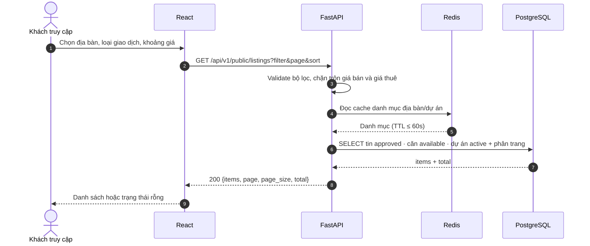
```mermaid
sequenceDiagram
    autonumber
    actor G as Khách truy cập
    participant W as React
    participant A as FastAPI
    participant R as Redis
    participant D as PostgreSQL

    G->>W: Chọn địa bàn, loại giao dịch, khoảng giá
    W->>A: GET /api/v1/public/listings?filter&page&sort
    A->>A: Validate bộ lọc, chặn trộn giá bán và giá thuê
    A->>R: Đọc cache danh mục địa bàn/dự án
    R-->>A: Danh mục (TTL ≤ 60s)
    A->>D: SELECT tin approved · căn available · dự án active + phân trang
    D-->>A: items + total
    A-->>W: 200 {items, page, page_size, total}
    W-->>G: Danh sách hoặc trạng thái rỗng
```

### 6.2 Out-of-scope access — authorization failure twin

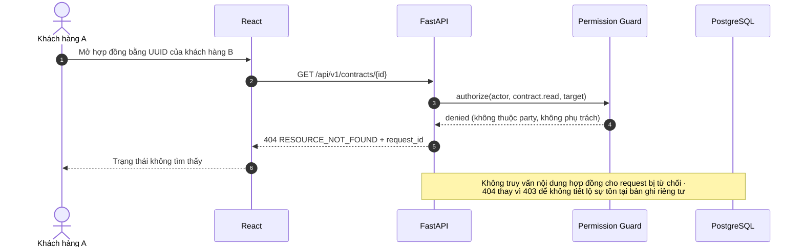
```mermaid
sequenceDiagram
    autonumber
    actor C as Khách hàng A
    participant W as React
    participant A as FastAPI
    participant P as Permission Guard
    participant D as PostgreSQL

    C->>W: Mở hợp đồng bằng UUID của khách hàng B
    W->>A: GET /api/v1/contracts/{id}
    A->>P: authorize(actor, contract.read, target)
    P-->>A: denied (không thuộc party, không phụ trách)
    A-->>W: 404 RESOURCE_NOT_FOUND + request_id
    W-->>C: Trạng thái không tìm thấy
    Note over A,D: Không truy vấn nội dung hợp đồng cho request bị từ chối ·<br/>404 thay vì 403 để không tiết lộ sự tồn tại bản ghi riêng tư
```

### 6.3 Send for signing — property hold success and conflict

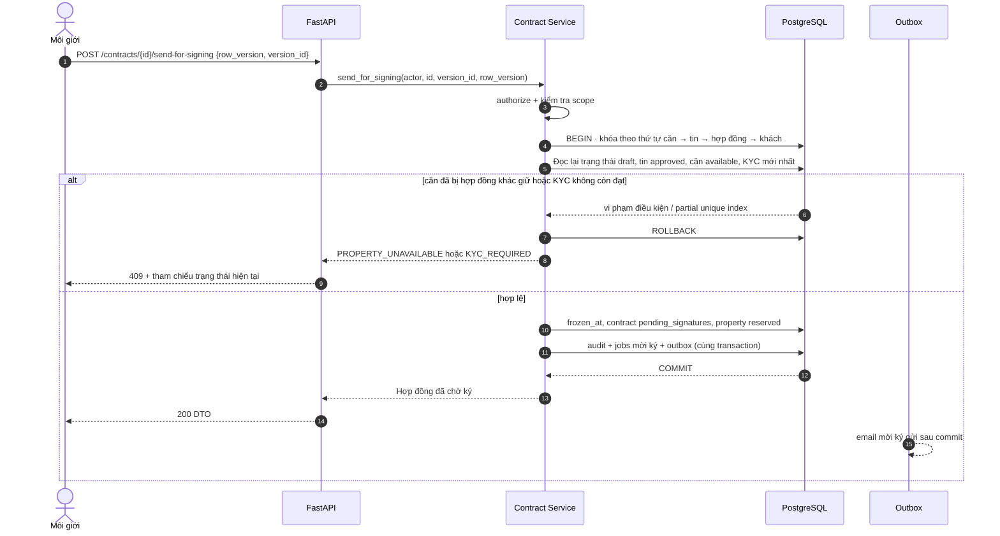
```mermaid
sequenceDiagram
    autonumber
    actor MG as Môi giới
    participant A as FastAPI
    participant S as Contract Service
    participant D as PostgreSQL
    participant O as Outbox

    MG->>A: POST /contracts/{id}/send-for-signing {row_version, version_id}
    A->>S: send_for_signing(actor, id, version_id, row_version)
    S->>S: authorize + kiểm tra scope
    S->>D: BEGIN · khóa theo thứ tự căn → tin → hợp đồng → khách
    S->>D: Đọc lại trạng thái draft, tin approved, căn available, KYC mới nhất
    alt căn đã bị hợp đồng khác giữ hoặc KYC không còn đạt
        D-->>S: vi phạm điều kiện / partial unique index
        S->>D: ROLLBACK
        S-->>A: PROPERTY_UNAVAILABLE hoặc KYC_REQUIRED
        A-->>MG: 409 + tham chiếu trạng thái hiện tại
    else hợp lệ
        S->>D: frozen_at, contract pending_signatures, property reserved
        S->>D: audit + jobs mời ký + outbox (cùng transaction)
        D-->>S: COMMIT
        S-->>A: Hợp đồng đã chờ ký
        A-->>MG: 200 DTO
        O-->>O: email mời ký gửi sau commit
    end
```

### 6.4 OTP signing — second signature completes the transaction

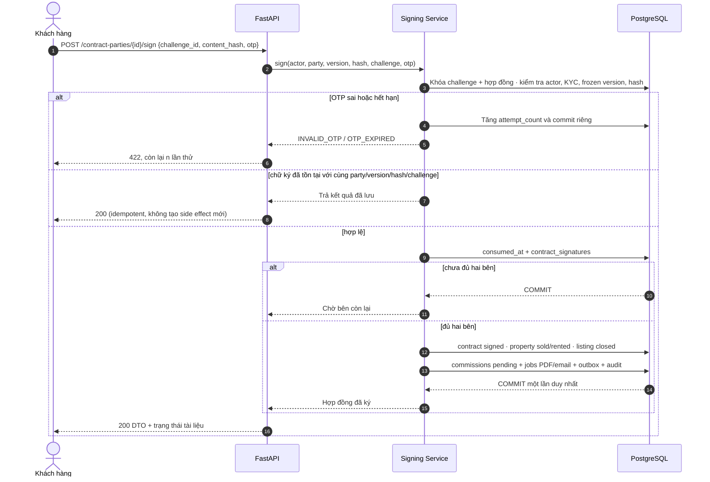
```mermaid
sequenceDiagram
    autonumber
    actor KH as Khách hàng
    participant A as FastAPI
    participant S as Signing Service
    participant D as PostgreSQL

    KH->>A: POST /contract-parties/{id}/sign {challenge_id, content_hash, otp}
    A->>S: sign(actor, party, version, hash, challenge, otp)
    S->>D: Khóa challenge + hợp đồng · kiểm tra actor, KYC, frozen version, hash
    alt OTP sai hoặc hết hạn
        S->>D: Tăng attempt_count và commit riêng
        S-->>A: INVALID_OTP / OTP_EXPIRED
        A-->>KH: 422, còn lại n lần thử
    else chữ ký đã tồn tại với cùng party/version/hash/challenge
        S-->>A: Trả kết quả đã lưu
        A-->>KH: 200 (idempotent, không tạo side effect mới)
    else hợp lệ
        S->>D: consumed_at + contract_signatures
        alt chưa đủ hai bên
            D-->>S: COMMIT
            S-->>A: Chờ bên còn lại
        else đủ hai bên
            S->>D: contract signed · property sold/rented · listing closed
            S->>D: commissions pending + jobs PDF/email + outbox + audit
            D-->>S: COMMIT một lần duy nhất
            S-->>A: Hợp đồng đã ký
        end
        A-->>KH: 200 DTO + trạng thái tài liệu
    end
```

### 6.5 Post-commit side effect — outbox, worker and retry

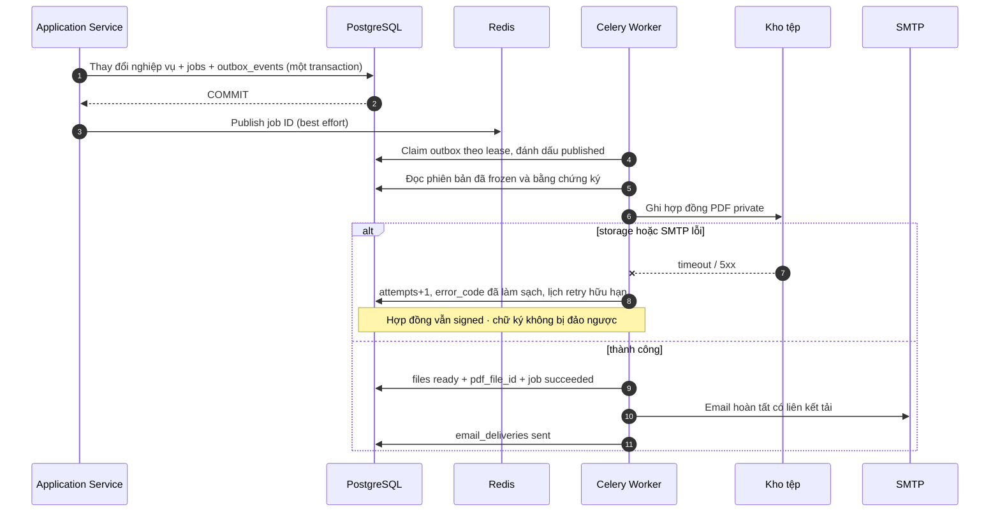
```mermaid
sequenceDiagram
    autonumber
    participant S as Application Service
    participant D as PostgreSQL
    participant R as Redis
    participant W as Celery Worker
    participant F as Kho tệp
    participant M as SMTP

    S->>D: Thay đổi nghiệp vụ + jobs + outbox_events (một transaction)
    D-->>S: COMMIT
    S->>R: Publish job ID (best effort)
    W->>D: Claim outbox theo lease, đánh dấu published
    W->>D: Đọc phiên bản đã frozen và bằng chứng ký
    W->>F: Ghi hợp đồng PDF private
    alt storage hoặc SMTP lỗi
        F--xW: timeout / 5xx
        W->>D: attempts+1, error_code đã làm sạch, lịch retry hữu hạn
        Note over W,D: Hợp đồng vẫn signed · chữ ký không bị đảo ngược
    else thành công
        W->>D: files ready + pdf_file_id + job succeeded
        W->>M: Email hoàn tất có liên kết tải
        W->>D: email_deliveries sent
    end
```

---

## 7. Deployment View

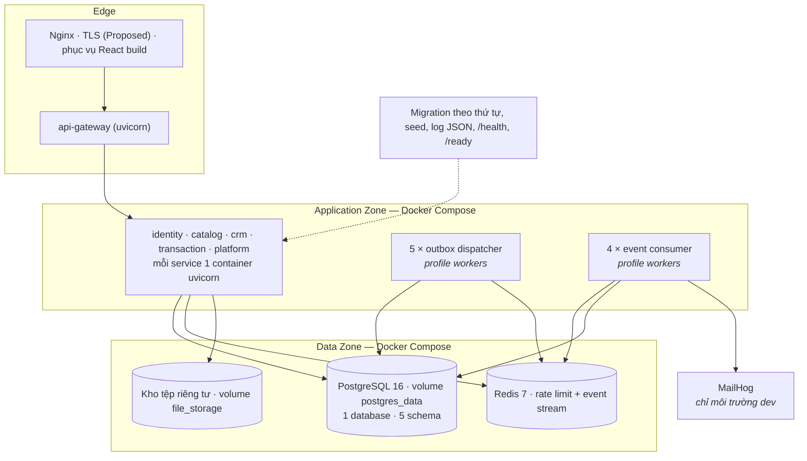
```mermaid
flowchart TB
    subgraph edge["Edge"]
        proxy["Nginx · TLS (Proposed) · phục vụ React build"]
        gw["api-gateway (uvicorn)"]
    end

    subgraph app["Application Zone — Docker Compose"]
        svc["identity · catalog · crm · transaction · platform<br/>mỗi service 1 container uvicorn"]
        outbox["5 × outbox dispatcher<br/><i>profile workers</i>"]
        events["4 × event consumer<br/><i>profile workers</i>"]
    end

    subgraph data["Data Zone — Docker Compose"]
        pg[("PostgreSQL 16 · volume postgres_data<br/>1 database · 5 schema")]
        redis[("Redis 7 · rate limit + event stream")]
        files[("Kho tệp riêng tư · volume file_storage")]
    end

    dev["MailHog<br/><i>chỉ môi trường dev</i>"]
    ops["Migration theo thứ tự, seed, log JSON, /health, /ready"]

    proxy --> gw
    gw --> svc
    svc --> pg
    svc --> redis
    svc --> files
    outbox --> pg
    outbox --> redis
    events --> redis
    events --> pg
    events --> dev
    ops -.-> svc
```

**Deployment rules**

| Rule | Reason |
|---|---|
| Trình duyệt chỉ tới Nginx; gateway là upstream backend duy nhất của Nginx | một bảng định tuyến, không nhân đôi ở hai nơi |
| `/internal` không bao giờ ra Internet: Nginx trả `404`, gateway không chuyển tiếp, và service yêu cầu `X-Internal-Key` | ba lớp chặn cho API service-to-service |
| Gateway **xóa** `X-Internal-Key` đến từ client trước khi chuyển tiếp | nếu không, client tự đặt header là đi thẳng qua mọi kiểm tra nội bộ |
| Cổng của từng service (8001–8005) chỉ mở khi dev; sản phẩm thật không expose | tránh đường vòng qua gateway và qua rate limit biên |
| Migration Alembic chạy như bước riêng, **đúng thứ tự** identity → platform → crm → catalog → transaction | FK liên schema cần bảng đích tồn tại trước; thứ tự ngược lại khi downgrade |
| Thay đổi nghiệp vụ và `jobs`/`outbox_events`/`event_outbox` nằm trong cùng transaction | không mất side effect và không phát sự kiện cho thứ đã rollback |
| Bí mật lấy từ biến môi trường; `JWT_SECRET_KEY` và `INTERNAL_API_KEY` không có giá trị mặc định | thiếu là service dừng khi khởi động, thay vì chạy với secret ai cũng đoán được |
| `/health` là liveness (không chạm phụ thuộc); `/ready` kiểm tra PostgreSQL và Redis, trả `503` khi chưa sẵn sàng | Postgres chậm không nên làm orchestrator giết container, nhưng cũng không nên nhận traffic |
| Rate limit chỉ bật ở gateway, tắt ở service phía sau | service chỉ thấy IP của gateway; bật ở đó sẽ chặn nhầm toàn bộ người dùng |
| Tiến trình nền chạy tách khỏi tiến trình HTTP, có thể nhiều bản sao | `FOR UPDATE SKIP LOCKED` ở outbox và consumer group ở Redis đều an toàn khi chạy song song |
| Seed ≥ 2.000 bản ghi và ba tài khoản demo chạy được sau migration | điều kiện nghiệm thu NFR-06 và đo hiệu năng NFR-04 |

`make up` dựng 11 container (postgres, redis, 5 service, gateway, frontend, nginx, mailhog); `make workers` thêm 9 tiến trình nền (5 outbox dispatcher + 4 event consumer; identity chưa nghe sự kiện của service nào). `make ready` gọi `/ready` của từng service để biết phụ thuộc nào đang hỏng.

---

## 8. Crosscutting Concepts

| Concept | Rule | Detail |
|---|---|---|
| **Identity** | mọi request nghiệp vụ có actor do server xác lập từ JWT | access token 15 phút, claim `sub/exp/iat/auth_version`; không có refresh token trong MVP |
| **Session revocation** | `auth_version` trong DB là nguồn sự thật | tăng khi đăng xuất, reset mật khẩu, khóa tài khoản, đổi quyền; API so sánh với claim |
| **Authorization** | deny-by-default ở API; ẩn nút trên UI không phải bảo mật | quyền = permission hành động + scope bản ghi; Admin cũng cần `contract.sign_representative`, `kyc.read_sensitive`, `commission.pay` |
| **Validation** | schema validate ở router; invariant và quy tắc trạng thái ở service | lỗi trường dùng `422`, xung đột trạng thái/phiên bản dùng `409` |
| **Error handling** | envelope thống nhất `{error:{code,message,details}, request_id}` | không trả SQL, stack trace, token hay dữ liệu KYC; mã nghiệp vụ ổn định theo SPEC §3.2 |
| **Workflow** | endpoint dạng lệnh, không PATCH `status` tùy ý | mỗi transition kiểm tra actor, trạng thái hiện tại, guard và `row_version` |
| **Transaction** | service sở hữu transaction boundary | cập nhật aggregate + audit + jobs/outbox phải nguyên tử; không gọi SMTP/KYC/storage trong lúc giữ khóa |
| **Concurrency** | khóa theo thứ tự toàn ứng dụng: căn → tin → hợp đồng → khách → party/challenge | `row_version` cho optimistic lock; partial unique index là lớp chặn cuối |
| **Immutability** | phiên bản hợp đồng, chữ ký, audit chỉ ghi thêm | `content_hash` tính trên `signed_document` đã chuẩn hóa; `internal_terms` không lọt vào nội dung khách ký |
| **Audit** | mọi thay đổi nhạy cảm ghi actor, action, entity, thời điểm server, request ID | audit nghiệp vụ ghi trong transaction nghiệp vụ; log HTTP của middleware là truy vết vận hành, không thay thế audit |
| **Jobs & idempotency** | `jobs.idempotency_key` + `outbox_events.event_key` | retry hữu hạn, đối soát job treo, không hứa exactly-once cho email |
| **Time** | lưu UTC, hiển thị `Asia/Ho_Chi_Minh` | bộ lọc ngày Việt Nam quy đổi thành `[đầu from_date, đầu ngày sau to_date)` |
| **Money** | `numeric`, Decimal ở backend, VND nguyên | hoa hồng `round(base × rate / 100, 0)` half-up; không dùng float |
| **Files** | kho tệp riêng tư, quyền suy từ hợp đồng/hóa đơn/job/KYC tham chiếu | tải qua API có quyền, `Content-Disposition: attachment`, không trả `storage_key` |
| **Caching** | cache danh mục và báo cáo TTL ≤ 60 giây, khóa chứa user/scope/quyền/bộ lọc | invalidate sau commit thay đổi danh mục; không dùng cache chung cho Admin và môi giới |
| **Logging** | structured log kèm request/job ID, redaction bắt buộc | không log mật khẩu, token, OTP, giấy tờ KYC hay nội dung hợp đồng |
| **UI state** | Loading, Empty, Forbidden, Validation, Conflict, Unavailable, Success | lỗi không làm mất dữ liệu biểu mẫu; không âm thầm fallback sang dữ liệu giả |
| **Demo mode** | adapter KYC/ký giả lập phải có nhãn rõ trên giao diện | không để khách tự gửi `status=verified`; không coi OTP email là chữ ký số được chứng thực |

---

<a id="architecture-decisions"></a>

## 9. Architecture Decisions (ADR index)

| ADR | Decision | Status |
|---|---|---|
| ADR-001 | Modular monolith FastAPI theo `app/modules/<domain>/`, ba tier React – FastAPI – PostgreSQL | **Superseded 21/09/2026 bởi [ADR-011](adr/ADR-011-microservice-decomposition.md)** |
| ADR-002 | PostgreSQL là system of record; [ERD](ERD.md) là schema contract, migration bằng Alembic | Accepted 17/09/2026 — migration đầu tiên đã áp dụng được trên database sạch |
| ADR-003 | Backend thực thi authorization theo hành động và phạm vi bản ghi; UI không phải security boundary | Accepted theo [PRD §3](PRD.md) và [SP-01](SPEC.md) |
| ADR-004 | Envelope lỗi `{error, request_id}` với mã nghiệp vụ ổn định; OpenAPI sinh từ FastAPI, gateway chỉ cung cấp chỉ mục | Accepted — đã Implemented trong `rem_shared/middleware/error_handler.py`, dùng chung cho cả 6 container |
| ADR-005 | JWT bearer 15 phút, không refresh token, thu hồi bằng `auth_version` | Proposed |
| ADR-006 | Ký hợp đồng bằng OTP email trên phiên bản đã đóng băng, hai bên theo A-02 | Proposed |
| ADR-007 | Giữ căn bằng partial unique index + khóa theo thứ tự cố định thay vì chỉ kiểm tra ở tầng ứng dụng | Proposed |
| ADR-008 | `jobs` + `outbox_events` trong PostgreSQL, Celery/Redis chỉ là phương tiện vận chuyển | Proposed |
| ADR-009 | Adapter cho KYC/SMTP/PDF/kho tệp, chế độ demo có nhãn; PDF dùng WeasyPrint, nhà cung cấp KYC chưa chọn | Proposed |
| ADR-010 | Redis dùng chung cho rate limit, cache và broker, tách namespace; fail closed cho route nhạy cảm | Accepted một phần — rate limit đã Implemented, cache chưa |
| [ADR-011](adr/ADR-011-microservice-decomposition.md) | Tách backend thành 5 microservice theo bounded context + api-gateway; một database nhiều schema, giữ FK liên schema; REST đồng bộ cho truy vấn, Redis Streams cho sự kiện | Accepted 21/09/2026 — cây source, Compose, CI và 5 lịch sử migration đã theo |

**Open decisions:** nhà cung cấp KYC; kho tệp là volume hay S3-compatible; hosting và HTTPS thật; chính sách sao lưu/RPO/RTO; chính sách lưu và xóa dữ liệu KYC; thông báo in-app; 2FA đăng nhập (FR-18, P1); JWT chuyển sang cặp khóa bất đối xứng; tách `reports` thành read model riêng; chính sách phát lại sự kiện từ DLQ.

Không ADR nào chuyển sang Accepted chỉ vì công nghệ đã xuất hiện trong `requirements.txt`, Compose hay sơ đồ. ADR Accepted phải có owner, ngày phê duyệt, alternatives và consequences.

---

## 10. Quality Requirements (stimulus → response → measure)

| # | Source | Stimulus | Environment | Response | Measure |
|---|---|---|---|---|---|
| QR1 | Khách hàng A | dùng UUID hợp đồng/tệp/job của khách hàng B | production-like | từ chối trước khi đọc dữ liệu nghiệp vụ | 100% test ngoài scope trả `401/403/404`; không lộ `internal_terms`, hoa hồng, KYC thô (SPEC T-02/T-08) |
| QR2 | Hai môi giới | gửi ký hai hợp đồng cho cùng một căn | request đồng thời | đúng một hợp đồng giữ căn | request còn lại `409`; không tồn tại căn `reserved` với hợp đồng `draft` (T-05) |
| QR3 | Hai bên hợp đồng | ký đồng thời, hoặc ký lặp sau timeout | retry | hoàn tất đúng một lần | đúng hai `contract_signatures`, một `commissions`, một job PDF (T-07) |
| QR4 | Khách hàng | nhập OTP sai nhiều lần | rate limit bật | khóa challenge sau 5 lần | `attempt_count` vẫn tăng khi response là lỗi; vượt ngưỡng trả `429` (T-06) |
| QR5 | Nhà cung cấp KYC | callback giả, lặp, cũ hoặc timeout | sau khi tạo yêu cầu | không đổi kết quả sai | callback không xác thực bị từ chối; timeout giữ `pending` rồi `failed`, không thành `verified` (T-04) |
| QR6 | SMTP/kho tệp/Redis | lỗi sau khi DB đã commit | worker đang chạy | trạng thái nghiệp vụ giữ nguyên | hợp đồng vẫn `signed`; outbox phát lại; không nhân đôi hoa hồng hay tệp (T-12) |
| QR7 | Admin | nhập Excel có một dòng sai | job import | không ghi bản ghi nghiệp vụ nào | rollback toàn bộ, trả dòng/cột lỗi; retry không nhập lần hai (T-10) |
| QR8 | Admin / môi giới | xem dashboard ở ranh giới ngày Việt Nam | dữ liệu seed xác định | số liệu khớp dữ liệu gốc | không đếm trùng do join; cache ≤ 60 giây và không lẫn scope (T-11) |
| QR9 | Người dùng | tải danh sách/tìm kiếm có bộ lọc | ≥ 2.000 bản ghi, 20 user đồng thời | trả trang đã lọc theo quyền | p95 ≤ 2 giây, truy vấn có giới hạn, không N+1 (NFR-04) |
| QR10 | Người chấm | kiểm tra bàn giao | môi trường sạch | dựng được hệ thống từ repo | Compose up + migration + seed ≥ 2.000 bản ghi chạy được; coverage backend ≥ 40% (NFR-05/06) |

Các ngưỡng chưa được đo trên môi trường thật là **provisional** và phải benchmark lại trước khi báo cáo nghiệm thu.

---

## 11. Risks and Technical Debt

| # | Risk | Impact | Likelihood | Mitigation | Owner |
|---|---|---|---|---|---|
| R1 | Bộ tài liệu đầy đủ (PRD/SPEC/ERD/USE_CASES) bị hiểu là hệ thống đã chạy, trong khi 14 module còn rỗng | High | High | nhãn Implemented/Skeleton/Proposed trong tài liệu này; không nhận nghiệm thu theo tài liệu mà không có test | Architecture |
| ~~R2~~ | Compose trỏ sai đường dẫn backend | — | Đã xử lý 17/09/2026 | `build.context`/volume đã sửa, thêm service frontend/nginx, smoke test có trong CI | Backend |
| ~~R3~~ | Chưa có Alembic migration | — | Đã xử lý 17/09/2026 | migration đầu tiên áp dụng được trên database sạch, 13 test invariant chạy trên PostgreSQL thật | Data + Backend |
| R4 | Nginx đã có cấu hình và nằm trong Compose, nhưng chưa có TLS | Medium | Medium | cấu hình TLS khi chốt domain/hosting | Operations |
| R5 | CI đã có 4 job với coverage gate 40% nhưng chưa chạy lần nào trên GitHub Actions | Medium | Medium | push nhánh và xác nhận cả 4 job xanh trước khi mở Phase 2 | Architecture |
| R6 | Frontend còn template Vite, dễ bị hiểu là UI đã có | Medium | High | dựng app shell, guard và API client trước feature; không dùng dữ liệu giả khi API lỗi | Frontend |
| ~~R7~~ | `requirements.txt` không pin phiên bản | — | Đã xử lý 17/09/2026 | toàn bộ dependency trực tiếp đã pin, tách `requirements-dev.txt` | Backend |
| R8 | Redis vừa là cache vừa là broker; eviction có thể làm mất job | High | Medium | tách namespace/database, chính sách eviction riêng, dựa vào `jobs`/`outbox_events` làm nguồn sự thật | Backend |
| R9 | Business rule rò vào router hoặc React | High | Medium | ranh giới router → service → repository, code review, fitness test | Backend lead |
| R10 | Phân quyền chỉ ẩn nút, thiếu kiểm tra scope ở API | Critical | Medium | test deny-by-default cho từng vai trò và từng scope bản ghi | Security |
| R11 | Adapter KYC/OTP demo bị trình bày như xác thực danh tính và chữ ký số thật | High | Medium | nhãn demo trên UI và trong tài liệu; A-04/A-05 nêu rõ giới hạn | Product |
| R12 | Dữ liệu KYC/OTP/hợp đồng lọt vào log, export hay response | Critical | Medium | redaction bắt buộc, allowlist cột khi export, test không có secret trong log | Security |
| ~~R13~~ | `JWT_SECRET_KEY` có giá trị mặc định không an toàn | — | Đã xử lý 17/09/2026 | `Settings` bắt buộc biến môi trường, không còn default; `.env` vẫn ngoài git | Operations |
| R14 | `docs/API.md` và `docs/DEPLOYMENT.md` chưa tồn tại (task 10.4/10.5) nhưng thuộc bộ bàn giao NFR-09 | Medium | High | sinh OpenAPI/Postman từ implementation và viết hướng dẫn triển khai trước mốc M4 | Architecture |

**Accepted technical debt:** chưa có. Mọi technical debt chỉ được Accepted khi có owner, impact và điều kiện xem lại.

---

## 12. Architecture Fitness Functions

Các gate dưới đây là target bắt buộc. Gate chưa có job chạy được vẫn giữ trạng thái Planned.

| Test / Gate | Rule enforced | Fails when | Status / planned location |
|---|---|---|---|
| `FrontendCannotAccessDatabase` | C2, §5.1 | frontend có dependency/import driver DB hoặc connection string | Planned — `tests/architecture` |
| `LayersPointInward` | §5.3 | `service.py` import FastAPI/SQLAlchemy driver, hoặc `repository.py` import router | Planned — `tests/architecture` |
| `NoCrossServiceModelImport` | §5.5, ADR-011 | một service import model của service khác, hoặc `rem_shared` chứa model nghiệp vụ | Planned — `tests/architecture` |
| `ServiceDependencyGraphIsAcyclic` | §5.5, ADR-011 | `<pkg>/clients` tạo vòng phụ thuộc đồng bộ giữa các service | Planned — `tests/architecture` |
| `InternalRoutesAreNotPublic` | §7, Q1 | router dưới `/internal` thiếu `require_internal_caller`, hoặc gateway chuyển tiếp `X-Internal-Key` từ client | Planned — security tests |
| `NoCrossModuleTableWrites` | §5.5 | module ghi trực tiếp bảng do module khác sở hữu | **Available một phần** — service không còn model của bảng ngoài schema mình; phần trong cùng service vẫn cần test |
| `EveryBusinessEndpointRequiresAuthorization` | Q1 | router nghiệp vụ thiếu dependency actor/permission | Planned — security tests |
| `RestrictedFieldsAreAllowlisted` | Q1, Q4 | response/export chứa `internal_terms`, hoa hồng hoặc KYC thô cho vai trò không được phép | Planned — contract tests |
| `EveryStateChangeUsesACommand` | Q3 | schema cho phép client gửi `status`, `signed_at`, `paid_at` | Planned — contract tests |
| `EveryCommandWritesAudit` | Q2 | lệnh nhạy cảm commit mà không có `audit_logs` cùng transaction | Planned — integration tests |
| `PropertyHoldIsExclusive` | Q2, QR2 | hai hợp đồng cùng giữ một căn | **Available một phần** — `tests/integration/test_schema_invariants.py`; phần căn `reserved` với hợp đồng `draft` cần service ở Phase 6 |
| `SigningIsIdempotent` | Q5, QR3 | ký lặp tạo thêm chữ ký, hoa hồng hoặc job PDF | Planned — integration tests |
| `OutboxIsAtomicWithBusinessChange` | Q5 | commit nghiệp vụ mà thiếu `jobs`/`outbox_events`/`event_outbox` hoặc ngược lại | Planned — DB integration tests |
| `EventHandlersAreIdempotent` | Q5, ADR-011 | giao lại cùng một `event_id` tạo side effect lần hai | Planned — integration tests |
| `KycCallbackConformance` | QR5 | callback giả/lặp/cũ làm đổi trạng thái KYC | Planned — integration conformance tests |
| `ImportIsAllOrNothing` | QR7 | một dòng lỗi vẫn ghi được bản ghi nghiệp vụ | Planned — integration tests |
| `MigrationsApplyOnCleanDatabase` | C4 | `alembic upgrade head` của một trong 5 service fail hoặc lệch model | **Available** — job `test` của CI chạy `downgrade base` rồi `upgrade head` cho cả 5, đúng thứ tự phụ thuộc |
| `NoSensitiveDataInLogs` | Q4, §8 | log chứa token, OTP, mật khẩu hoặc giấy tờ KYC | Planned — security tests |
| `ReadPerformanceBudget` | Q6, QR9 | list/search vượt p95 2 giây với dữ liệu seed | Planned — performance job |
| `CoverageGate` | Q8, NFR-05 | coverage backend dưới 40% line | **Available** — `pytest --cov-fail-under=40`, hiện 92,9% |
| `ComposeSmokeTest` | R2, Q8 | `docker compose up` không dựng được 5 service, gateway hoặc db; `/ready` của service nào đó trả 503 | **Available** — job `smoke` của CI |
| `HttpPipelineContract` | ADR-004, ADR-010 | envelope lỗi, request ID hoặc rate limit fail-closed sai hành vi | **Available** — `src/backend/libs/rem-shared/tests/unit/test_middleware.py` |

Một rule chỉ được đánh dấu **Enforced** khi test/job thực sự tồn tại, có thể fail và là required trong CI.

---

**Requirements:** [PRD](PRD.md) · **Đặc tả triển khai:** [SPEC](SPEC.md) · **Dữ liệu:** [ERD](ERD.md) · **Use cases:** [USE_CASES](USE_CASES.md) · **Kế hoạch:** [PLAN](PLAN.md) · **Yêu cầu gốc:** [yeu_cau.pdf](yeu_cau.pdf)
