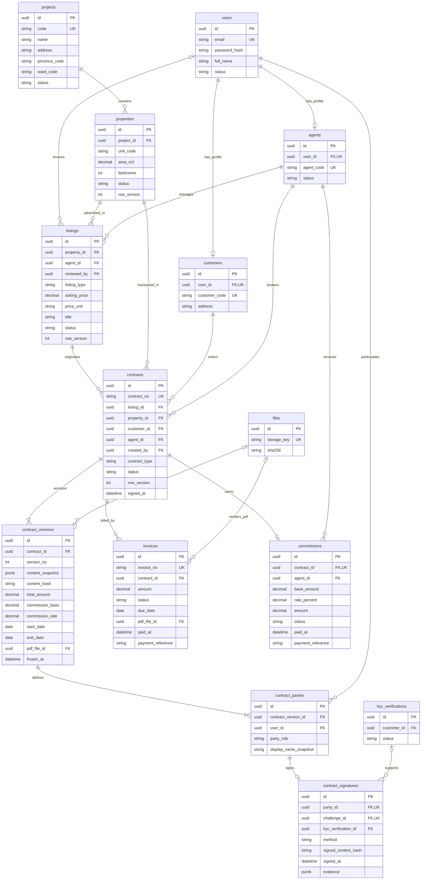
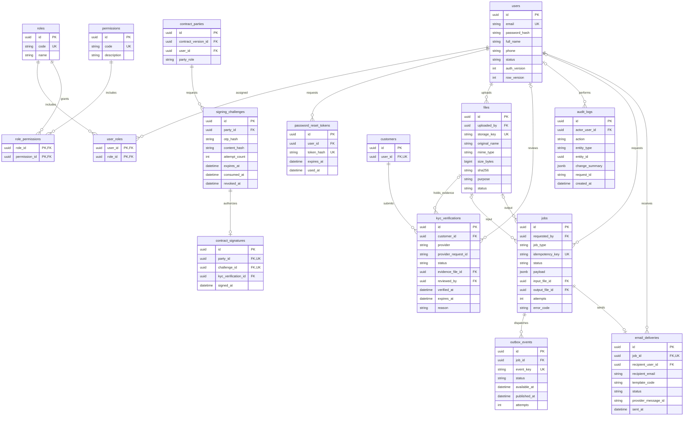

# ERD — Hệ thống quản lý bất động sản

| Thuộc tính | Nội dung |
| --- | --- |
| Phiên bản | 1.0 — thiết kế logic đề xuất, 06/09/2026 |
| Căn cứ | [yeu_cau.pdf](yeu_cau.pdf), [PRD](PRD.md), [Kiến trúc](ARCHITECTURE.md) |
| Cơ sở dữ liệu | PostgreSQL; ORM SQLAlchemy, migration Alembic |
| Trạng thái | Chưa phải schema đã triển khai; các file `models.py` hiện còn trống |

Thiết kế giữ đủ bảy thực thể chính trong PDF: `projects`, `properties`, `listings`, `contracts`, `customers`, `agents`, `invoices`. Các bảng bổ sung phục vụ RBAC, KYC, ký theo phiên bản, hoa hồng, lưu tệp, audit và tác vụ nền. Quy tắc nghiệp vụ tuân theo các giả định A-01 đến A-08 trong PRD.

## 1. Quy ước

- `PK`: khóa chính; `FK`: khóa ngoại; `UK`: duy nhất. `||` là đúng một, `o|` là không hoặc một, `o{` là không hoặc nhiều, `|{` là một hoặc nhiều.
- ID dùng UUID; thời gian dùng `timestamptz`, lưu UTC, hiển thị Asia/Ho_Chi_Minh. Tiền dùng `numeric(18,2)`, tỷ lệ phần trăm `numeric(7,4)`, không dùng float; MVP chỉ nhận số tiền nguyên VND và làm tròn hoa hồng đến đồng.
- Trường mặc định NOT NULL trừ trường được ghi rõ nullable ở mục 4. Trường không xuất hiện trên sơ đồ nhưng được liệt kê trong từ điển vẫn thuộc thiết kế.
- Bảng nghiệp vụ có `created_at`, `updated_at`; bảng chỉ ghi thêm có `created_at`. Các trường dùng chung được lược khỏi sơ đồ để dễ đọc; mục 5 quy định phạm vi áp dụng.
- `row_version` là số nguyên tăng dần để khóa lạc quan. `version_no` trong `contract_versions` là phiên bản nội dung hợp đồng, có ý nghĩa khác.
- FK mặc định `ON DELETE RESTRICT`. Không cascade xóa hồ sơ giao dịch, bằng chứng ký hoặc audit. Xóa mềm không bỏ qua kiểm tra quyền hay quy tắc duy nhất.

## 2. Sơ đồ dữ liệu nghiệp vụ

`users`, `files`, `kyc_verifications` được lặp ở sơ đồ 3 để nối ngữ cảnh, không phải bảng khác. Quan hệ một hợp đồng có ít nhất một phiên bản và mỗi phiên bản có đủ bên ký phải được tạo trong giao dịch; FK đơn lẻ không bảo đảm được số lượng con tối thiểu.

## 3. Sơ đồ tài khoản, tích hợp và vận hành

Một job email chỉ gửi một người nhận; gửi hai bên hợp đồng tạo hai job. Thông báo in-app là mở rộng P1, chưa cần bảng riêng trong MVP chọn email. Không lưu cache Redis hay trạng thái nội bộ Celery như bảng quan hệ; `jobs` là nguồn trạng thái nghiệp vụ bền vững.

## 4. Từ điển dữ liệu bổ sung

Các trường dưới đây bổ sung hoặc làm rõ sơ đồ. Chuỗi mã/trạng thái dùng `varchar` kèm CHECK hoặc enum trong migration; nội dung dài dùng `text`.

| Bảng | Thuộc tính và ý nghĩa |
| --- | --- |
| `users` | Email chuẩn hóa chữ thường và trim trước khi lưu; `phone` nullable; `status`: `active/locked`; `auth_version` tăng khi reset mật khẩu, khóa tài khoản hoặc đổi quyền để thu hồi JWT cũ khi API kiểm tra. |
| `roles`, `permissions` | Seed role `admin/agent/customer`; permission dùng mã như `listing.approve`, `contract.sign_representative`, `commission.pay`. Scope bản ghi được kiểm tra tại service, không suy ra chỉ từ role. |
| `user_roles`, `role_permissions` | PK ghép như sơ đồ; `created_at`; một tài khoản có thể có nhiều role nhưng chỉ có một hồ sơ mỗi loại. Role customer/agent phải phù hợp hồ sơ khi cấp quyền trong giao dịch. |
| `password_reset_tokens` | Chỉ lưu hash token có độ ngẫu nhiên cao; `used_at` nullable; hết hạn/đã dùng bị từ chối. Token mới thu hồi token còn hiệu lực trước đó. |
| `customers` | `address` nullable; thông tin tên/email/điện thoại hiện tại lấy từ `users`. Không dùng hồ sơ có thể thay đổi để dựng lại hợp đồng đã ký. |
| `agents` | `status`: `active/inactive`; trạng thái inactive chặn giao dịch mới, giữ lịch sử cũ. |
| `projects` | Bổ sung `description` nullable; `status`: `active/inactive`; địa bàn lưu code để lọc, địa chỉ lưu text. Danh mục địa bàn được cấu hình/seed, không hardcode một hệ thống mã trong PRD. |
| `properties` | Bổ sung `floor` nullable, `description` nullable; `status`: `available/reserved/sold/rented`; vị trí kế thừa dự án; `area_m2 > 0`, `bedrooms >= 0`. |
| `listings` | Bổ sung `description`, `currency='VND'`, `reviewed_at` nullable, `rejection_reason` nullable; `reviewed_by` nullable trước khi duyệt; `listing_type`: `sale/rent`; `price_unit`: `total/month`; trạng thái theo PRD. |
| `contracts` | Bổ sung `cancelled_at`, `cancelled_by` (FK users), `cancellation_reason`, đều nullable trước hủy; `signed_at` nullable đến khi ký đủ; `contract_type`: `sale/rent`; `created_by` FK users. Các FK nghiệp vụ và loại giao dịch cố định sau khi tạo. |
| `contract_versions` | Bổ sung `created_by` FK users, `currency='VND'`; `content_snapshot` chứa địa chỉ/mã căn, mô tả tin, các bên, điều khoản, giá/cơ sở hoa hồng và thông tin đơn vị đại diện tại thời điểm tạo; `start_date/end_date` nullable với bán, bắt buộc với thuê; `pdf_file_id/frozen_at` nullable trước xuất PDF/gửi ký. |
| `contract_parties` | `party_role`: `customer/representative`; bắt buộc đúng hai bên cho mỗi phiên bản theo A-02. `display_name_snapshot` lưu tên tại thời điểm lập. `user_id` của bên khách phải trùng tài khoản của `contracts.customer_id`; bên đại diện phải có quyền ký đại diện. |
| `signing_challenges` | `consumed_at/revoked_at` nullable; `attempt_count` mặc định 0, giới hạn theo PRD. OTP dùng HMAC với khóa bí mật hoặc cơ chế băm có bảo vệ phù hợp, không dùng hash trần dễ vét cạn cho OTP ngắn; hash ràng buộc challenge/bên ký. |
| `contract_signatures` | `method='email_otp'` cho demo; `evidence` chỉ chứa dữ liệu cần thiết như request ID, IP/user-agent nếu có chính sách lưu; không chứa OTP. `kyc_verification_id` nullable với đại diện, bắt buộc với khách. |
| `invoices` | Bổ sung `created_by` FK users, `issued_at`, `paid_by` FK users, `voided_at`, `voided_by` FK users, `void_reason`, `content_snapshot` JSONB và `currency='VND'`; snapshot đóng băng lúc phát hành. `due_date`, `pdf_file_id`, các thời điểm/người xử lý/tham chiếu nullable trước bước tương ứng. |
| `commissions` | Bổ sung `approved_by`, `paid_by` (FK users), `approved_at`, `cancelled_at`, `cancelled_by` (FK users), `cancellation_reason`; các trường duyệt/chi/hủy nullable trước xử lý; `payment_reference/paid_at` nullable trước chi. Số tiền/cơ sở/tỷ lệ là snapshot từ phiên bản đã ký. |
| `kyc_verifications` | Mỗi lần gửi là một bản ghi; `provider_request_id` nullable trước gửi thành công; `evidence_file_id`, `reviewed_by`, `verified_at`, `expires_at`, `reason` nullable. `reviewed_by` dùng cho thao tác quản trị/demo; callback nhà cung cấp được audit dưới actor hệ thống. Trạng thái `pending/verified/rejected/failed`. |
| `files` | `uploaded_by` là người yêu cầu upload hoặc người khởi tạo xuất tài liệu; worker ghi file thay mặt người đó. `purpose`: `contract_pdf/invoice_pdf/report/import/kyc`; `status`: `pending/ready/failed`; `storage_key` là khóa kho tệp riêng tư, không phải URL công khai. `size_bytes/sha256` nullable trước `ready`. |
| `audit_logs` | `actor_user_id` nullable cho worker/callback; bổ sung `actor_type` (`user/system`); `entity_type/entity_id` là tham chiếu đa hình, **không phải FK**. `change_summary` lưu thay đổi đã loại bí mật và dữ liệu KYC thô; chỉ ghi thêm. |
| `jobs` | `requested_by` nullable cho tác vụ hệ thống; `input_file_id/output_file_id/error_code` nullable; bổ sung `started_at/finished_at` nullable, `max_attempts`; `job_type`: `send_email/generate_contract_pdf/generate_invoice_pdf/export_report/import_properties/import_projects/export_data`; payload chỉ chứa tham chiếu và bộ lọc cần thiết. |
| `outbox_events` | Bổ sung `locked_until` nullable để giữ lease khi dispatcher nhận sự kiện; `published_at` nullable trước publish; `status`: `pending/publishing/published`; sự kiện lỗi publish quay lại pending và tăng attempts. |
| `email_deliveries` | `recipient_email` là snapshot nơi nhận lúc tạo; `provider_message_id/sent_at` nullable trước gửi; `status`: `pending/sent/failed`. Không lưu OTP thô trong payload/job/email log; sinh challenge tại tác vụ gửi, chỉ lưu hash và hủy challenge nếu gửi thất bại hoặc gửi lại. |

## 5. Ràng buộc toàn vẹn

### 5.1. Khóa duy nhất và kiểm tra tại DB

| Bảng | Ràng buộc |
| --- | --- |
| `users` | UNIQUE email đã chuẩn hóa; email tài khoản xóa mềm vẫn được giữ để tránh tái sử dụng danh tính lịch sử. |
| `customers`, `agents` | UNIQUE `user_id` và mã hồ sơ; một tài khoản có thể có cả hai hồ sơ nhưng không được ký hai phía trên cùng hợp đồng. |
| `properties` | UNIQUE `(project_id, unit_code)`; mã căn không tái sử dụng sau xóa mềm. |
| `listings` | CHECK giá > 0; CHECK cặp `sale/total` hoặc `rent/month`; UNIQUE INDEX trên `property_id` WHERE `status IN ('pending','approved') AND deleted_at IS NULL`. |
| `contracts` | UNIQUE `contract_no`; UNIQUE INDEX trên `property_id` WHERE `status IN ('pending_signatures','signed') AND deleted_at IS NULL`; nhiều bản nháp được phép, chỉ một bản giữ căn. |
| `contract_versions` | UNIQUE `(contract_id, version_no)`; CHECK version_no > 0, total_amount > 0, commission_base >= 0, commission_rate BETWEEN 0 AND 100; nếu có cả ngày thì end_date > start_date. |
| `contract_parties` | UNIQUE `(contract_version_id, party_role)` và `(contract_version_id, user_id)`; giới hạn enum role. Việc có đủ đúng hai bên kiểm tra khi gửi ký. |
| `signing_challenges` | CHECK attempt_count >= 0 và <= giới hạn MVP; UNIQUE INDEX `party_id` WHERE `consumed_at IS NULL AND revoked_at IS NULL`. Gửi lại phải revoke challenge cũ, kể cả đã hết hạn; không dùng `now()` trong predicate index. |
| `contract_signatures` | UNIQUE `party_id`, UNIQUE `challenge_id`; một bên chỉ có một xác nhận ký trên một phiên bản; không xóa chữ ký để ký lại. |
| `invoices` | UNIQUE invoice_no; CHECK amount > 0; trạng thái paid yêu cầu paid_at, paid_by và payment_reference; void yêu cầu lý do/người/thời điểm. |
| `commissions` | UNIQUE contract_id; CHECK base_amount >= 0, rate_percent BETWEEN 0 AND 100; CHECK amount = round(base_amount * rate_percent / 100, 0); paid yêu cầu thông tin chi; approved/paid yêu cầu thông tin duyệt. |
| `kyc_verifications` | UNIQUE `(provider, provider_request_id)` khi mã yêu cầu khác NULL; UNIQUE INDEX customer_id WHERE status = 'pending', giới hạn một yêu cầu chờ mỗi khách; verified yêu cầu verified_at. |
| `files` | UNIQUE storage_key; CHECK size_bytes >= 0 khi có; ready yêu cầu sha256 và size_bytes. |
| `jobs`, `outbox_events` | UNIQUE idempotency_key / event_key; CHECK attempts >= 0, max_attempts > 0; jobs status thuộc `pending/running/succeeded/failed`. |

Những trường FK phi chuẩn hóa ở `contracts` (`listing_id`, `property_id`, `agent_id`, `contract_type`) phải thống nhất với tin nguồn. Có thể dùng khóa ngoại ghép tới khóa UNIQUE tương ứng trên `listings`; nếu chọn kiểm tra service thì phải khóa tin trong giao dịch và không cho sửa căn/môi giới/loại tin đã có hợp đồng. Tương tự, `commissions.agent_id` phải bằng môi giới của hợp đồng, có thể ràng buộc bằng FK ghép `(contract_id, agent_id)`.

### 5.2. Phiên bản, ký và giữ căn

1. Tạo hợp đồng, phiên bản đầu tiên và hai bên ký trong một giao dịch. Mỗi lần sửa bản nháp tạo phiên bản mới với snapshot và hai bên tương ứng; không cập nhật nội dung phiên bản cũ. Phiên bản hiện hành là `MAX(version_no)` của hợp đồng.
2. Snapshot được tuần tự hóa theo quy tắc cố định để tính SHA-256; hash bao gồm nội dung, giá và danh tính/vai trò các bên ký. `signed_content_hash` và `signing_challenges.content_hash` phải bằng hash phiên bản của `party_id`.
3. Gửi ký khóa hợp đồng và căn, kiểm tra `row_version`, căn `available`, tin `approved`, đủ hai bên và KYC khách đạt; đặt `frozen_at`, hợp đồng `pending_signatures`, căn `reserved`. Sau bước này không tạo phiên bản mới hoặc sửa/xóa bên ký.
4. Ký khóa challenge và hợp đồng; kiểm tra chưa hết hạn/chưa dùng/chưa revoke, số lần thử, đúng người và phiên bản; KYC là yêu cầu mới nhất của đúng khách, trạng thái verified, chưa hết hạn nếu có. Cập nhật consumed_at và chữ ký trong cùng giao dịch. Challenge của chữ ký phải thuộc chính party đó, thực thi bằng FK ghép hoặc kiểm tra có khóa tại service.
5. Chữ ký thứ hai hoàn tất giao dịch: đặt signed_at/status, chuyển căn sold/rented, đóng tin, tạo hoa hồng và jobs/outbox. UNIQUE index ngăn hai hợp đồng cùng chiếm căn; không chỉ dựa vào kiểm tra giao diện.
6. Worker đọc phiên bản đã frozen và chữ ký bất biến để tạo PDF; `pdf_file_id` chỉ trỏ file ready, purpose contract_pdf. Hash của PDF tại `files.sha256` khác hash nội dung chuẩn hóa; không dùng thay thế nhau.
7. Hủy hợp đồng chưa đủ chữ ký ghi actor/lý do/thời điểm, revoke challenge còn mở và giải phóng căn trong giao dịch. Chữ ký đã có vẫn giữ để audit. Không xóa/hủy hợp đồng signed trong MVP; vì thế căn rented không tự trở lại available.

Các kiểm tra liên bảng như KYC đúng khách, đủ bên ký, đúng purpose tệp, hoặc cấm sửa bản frozen không thực hiện được bằng CHECK thông thường; cần service có transaction/locking và có thể bổ sung trigger. Phải có integration test cho đường cập nhật cạnh tranh.

### 5.3. Soft-delete và versioning

- `users`, `customers`, `agents`, `projects`, `properties`, `listings`, `contracts` có `deleted_at` và `deleted_by` FK users nullable; có `row_version`. Không xóa mềm hợp đồng trừ bản `draft/cancelled`; bản có chữ ký được giữ, kể cả đã cancelled.
- Không xóa mềm dự án còn căn chưa xóa; không xóa căn có tin chưa đóng hoặc hợp đồng pending_signatures/signed; không xóa tin đang gắn hợp đồng đang hoạt động. Dữ liệu tham chiếu lịch sử vẫn tồn tại và không public qua danh sách mặc định.
- Người dùng/hồ sơ đã tham gia giao dịch dùng khóa tài khoản hoặc inactive thay cho xóa. Xóa mềm tài khoản chưa có ràng buộc lịch sử cần vô hiệu hóa đăng nhập, thu hồi token và ẩn các hồ sơ liên quan trong cùng giao dịch.
- `invoices`, `commissions` có row_version; dùng trạng thái void/cancelled thay xóa mềm. Không sửa số tiền hóa đơn đã issued hoặc khoản hoa hồng đã tạo; thay đổi nghiệp vụ cần chứng từ/quy tắc điều chỉnh riêng.
- `contract_versions`, `contract_parties`, `contract_signatures`, `audit_logs` chỉ ghi thêm về nội dung. Ngoại lệ kỹ thuật là gắn frozen_at/PDF vào phiên bản theo bước hợp lệ; không làm đổi snapshot/hash.
- `kyc_verifications`, `jobs`, `files`, `outbox_events`, `email_deliveries`, `signing_challenges`, `password_reset_tokens` có updated_at khi thay đổi trạng thái. Lịch sử KYC không bị ghi đè bởi lần gửi lại; trạng thái verified có thể chuyển rejected khi bị thu hồi, có audit. Chữ ký cũ vẫn giữ tham chiếu/bằng chứng tại thời điểm ký.

## 6. Tác vụ nền, audit và quyền tệp

**Outbox:** giao dịch nghiệp vụ tạo `jobs` và `outbox_events` cùng lúc. Một vòng dispatcher trong worker lấy sự kiện pending theo lease, publish ID job vào Redis, rồi đánh dấu published. Nếu crash sau publish nhưng trước cập nhật DB, sự kiện có thể gửi lại; worker kiểm tra idempotency và trạng thái job. Có bước đối soát job pending/running quá hạn để phát lại nếu broker mất thông điệp. Không coi outbox là bảo đảm email được gửi đúng một lần: nhà cung cấp có thể nhận mail trước khi worker kịp ghi kết quả; dùng idempotency của nhà cung cấp nếu có.

Khóa mẫu: `contract-pdf:{version_id}`, `commission:{contract_id}` cho nghiệp vụ nếu cần, `email:contract-signed:{contract_id}:{recipient_id}`. Retry dùng cùng job; một lần xuất báo cáo mới do người dùng yêu cầu có khóa mới. Không đặt ràng buộc UNIQUE cho payload bộ lọc vì hai lần xuất cùng bộ lọc vẫn là hai yêu cầu hợp lệ.

**Audit:** ghi bản ghi cùng giao dịch với thay đổi nghiệp vụ. Actor hệ thống có `actor_type=system`; không giả lập người dùng. `change_summary` lưu các giá trị cần kiểm chứng như trạng thái, số tiền và phiên bản, loại bỏ token, OTP, mật khẩu và nội dung định danh thô. Phân quyền đọc audit cho Admin; role ứng dụng không được sửa/xóa audit tùy ý.

**Tệp:** chủ thể có quyền được xác định từ hợp đồng/hóa đơn/job/KYC đang tham chiếu, không chỉ từ `uploaded_by`. Bên ký được tải hợp đồng của mình; môi giới chỉ tải hợp đồng phụ trách; KYC thô chỉ khách sở hữu và Admin có quyền chuyên biệt. Worker chạy dưới danh tính dịch vụ, ghi tệp thay người yêu cầu. Kiểm tra quyền khi tạo job và khi tải kết quả; payload không được tự mở rộng phạm vi export. Tệp vật lý chỉ xóa theo chính sách lưu đã chốt, sau khi kiểm tra tham chiếu; không cascade xóa từ tài khoản.

## 7. Chỉ mục và truy vấn chính

Ngoài index PK/UNIQUE, đề xuất các chỉ mục sau; PostgreSQL không tự tạo index cho mọi cột FK.

| Mục đích | Index đề xuất |
| --- | --- |
| Lọc địa điểm | `projects(province_code, ward_code)` và `properties(project_id, status)` |
| Tìm tin theo loại/giá | `listings(listing_type, asking_price, id)` WHERE status = 'approved' AND deleted_at IS NULL; join properties để lọc available |
| Danh sách môi giới/duyệt tin | `listings(agent_id, status, created_at, id)` và `listings(status, created_at, id)` |
| Hợp đồng theo người dùng | `contracts(customer_id, created_at, id)`, `contracts(agent_id, status, created_at, id)`, `contract_parties(user_id, contract_version_id)` |
| Dashboard | `contracts(status, created_at)`, `contracts(signed_at)` WHERE status = 'signed'; lọc soft-delete theo định nghĩa PRD |
| Chứng từ/hoa hồng | `invoices(contract_id, status)`, `commissions(agent_id, status, created_at)` |
| KYC | `kyc_verifications(customer_id, created_at)`; latest request quyết định trạng thái được hiển thị/cho phép gửi ký |
| Tác vụ và outbox | `jobs(status, created_at)`, `jobs(requested_by, created_at)`, `outbox_events(status, available_at)` |
| Audit | `audit_logs(entity_type, entity_id, created_at)`, `audit_logs(actor_user_id, created_at)` |

Tìm kiếm từ khóa tên dự án/tiêu đề có thể bắt đầu bằng truy vấn tham số hóa; cân nhắc trigram/full-text sau đo đạc. Báo cáo dùng COUNT DISTINCT hoặc tổng hợp riêng từng bảng trước join để tránh đếm lặp. Danh sách dùng khóa phụ `id` để thứ tự phân trang ổn định.

## 8. Đối chiếu ERD với PRD

| Yêu cầu PRD | Bảng chính |
| --- | --- |
| FR-01/02 — tài khoản và RBAC | users, roles, permissions, user_roles, role_permissions, password_reset_tokens |
| FR-03/04 — dự án, căn hộ | projects, properties |
| FR-05/06 — tin đăng, tìm kiếm | listings, projects, properties, agents |
| FR-07/08 — hồ sơ và KYC | customers, agents, kyc_verifications, files |
| FR-09/10 — ký và lưu hợp đồng | contracts, contract_versions, contract_parties, signing_challenges, contract_signatures, files |
| FR-11 — hoa hồng | commissions, contracts, agents |
| FR-12 — dashboard | Truy vấn listings/contracts/commissions; không cần bảng reports cho số liệu dẫn xuất |
| FR-13/14 — nhập/xuất | jobs, outbox_events, files và bảng nghiệp vụ được phép |
| FR-15 — email | jobs, outbox_events, email_deliveries |
| FR-16 — audit và phiên bản | audit_logs, contract_versions, row_version và trường soft-delete |
| FR-17 — hóa đơn nội bộ | invoices, contracts, files |
| FR-18 — 2FA tùy chọn | Chưa thiết kế bảng lưu secret/recovery code trong MVP; signing_challenges chỉ phục vụ ký hợp đồng |

## 9. Kịch bản kiểm chứng khi triển khai schema

1. Seed đủ ba role và permission, hai hồ sơ mẫu, dự án/căn/tin; tổng dữ liệu mẫu ít nhất 2.000 bản ghi theo yêu cầu PDF.
2. Thử trùng email, mã căn trong dự án, mã hợp đồng, giá âm và cặp sale/month: bị từ chối.
3. Hai giao dịch gửi hợp đồng cho cùng căn đồng thời: chỉ một hợp đồng giữ căn thành công.
4. Ký sai người, sai hash, OTP hết hạn/đã dùng, KYC sai khách/chưa đạt hoặc phiên bản chưa frozen: không tạo chữ ký.
5. Hai bên ký đồng thời hoặc gửi lại yêu cầu: chỉ một lần hoàn tất, một khoản hoa hồng và một job PDF cho phiên bản.
6. Sửa/xóa hợp đồng đã ký, sửa nội dung phiên bản cũ hoặc hóa đơn đã phát hành: bị từ chối; vẫn tải được PDF khi hồ sơ hiện tại thay đổi.
7. Giả lập DB commit thành công nhưng Redis lỗi: outbox còn lại và có thể phát lại; worker retry không nhân đôi hoa hồng/tệp tham chiếu.
8. Người khác lấy UUID hợp đồng/job/tệp vẫn không tải được dữ liệu; export chỉ chứa phạm vi quyền tại thời điểm xử lý.
9. Dashboard trên bộ dữ liệu xác định sẵn khớp số tin/hợp đồng, thời gian Việt Nam và điều kiện xóa mềm trong PRD.

Đây là danh sách kiểm chứng cần thực hiện khi có model/migration; việc viết tài liệu không đồng nghĩa các kiểm thử đã chạy.
