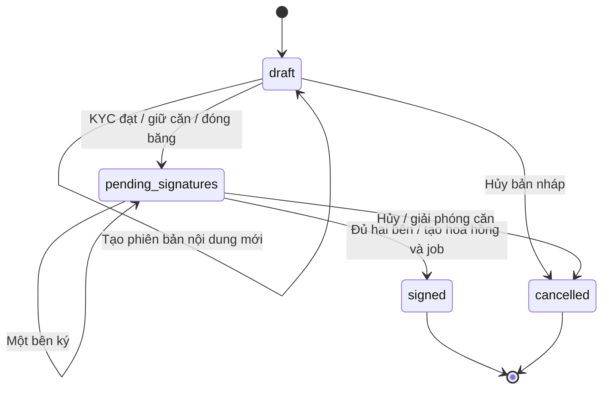

# SPEC — Đặc tả triển khai hệ thống quản lý bất động sản

| Thuộc tính | Nội dung |
| --- | --- |
| Phiên bản | 1.0 — đề xuất, 06/09/2026 |
| Căn cứ | [PRD](PRD.md), [ERD](ERD.md), [Kiến trúc](ARCHITECTURE.md), [Yêu cầu gốc](yeu_cau.pdf) |
| Luồng sử dụng | [USE_CASES](USE_CASES.md) |
| Trạng thái | Đặc tả mục tiêu để triển khai và kiểm thử; không xác nhận API/chức năng đã tồn tại |

## 1. Phạm vi và quy ước

SPEC quy định hành vi ứng dụng, hợp đồng giao tiếp tối thiểu, validation, transaction và điều kiện kiểm chứng. PRD quy định phạm vi sản phẩm; ERD quy định bảng và ràng buộc dữ liệu; USE_CASES mô tả tương tác người dùng. Các giả định A-01–A-08 của PRD được giữ nguyên: ba vai trò, hai bên ký, một căn/khách/môi giới cho mỗi hợp đồng, OTP email demo, KYC trước ký, VND và hóa đơn nội bộ.

Các giới hạn thời gian, dung lượng, độ dài và tên endpoint dưới đây là **mặc định kỹ thuật đề xuất**, không phải thông số bắt buộc trong PDF. Không bổ sung thanh toán online, chữ ký số nhà cung cấp, chấm dứt hợp đồng đã ký, gia hạn thuê hoặc 2FA đăng nhập vào MVP.

## 2. Thành phần và trách nhiệm

| Thành phần | Trách nhiệm |
| --- | --- |
| React | Điều hướng theo quyền, biểu mẫu, danh sách/bộ lọc, trạng thái tác vụ, xem và ký hợp đồng; không tự quyết định quyền hay tính tiền cuối cùng |
| FastAPI router/schema | Parse và validate dữ liệu, xác thực, ánh xạ lỗi; sinh OpenAPI; gọi service |
| Service/permissions | Kiểm tra quyền + scope bản ghi, quy tắc trạng thái, transaction, snapshot, idempotency và audit |
| Repository/SQLAlchemy | Truy vấn tham số hóa, khóa bản ghi và cập nhật có điều kiện; không tự commit giữa một nghiệp vụ nguyên tử |
| PostgreSQL | Nguồn dữ liệu chuẩn; FK/UNIQUE/CHECK, phiên bản, chữ ký, job và outbox theo ERD |
| Redis | Cache, rate limit và Celery broker; tách namespace và chính sách cache/broker |
| Celery + dispatcher | Publish outbox, gửi email, nhập/xuất, tạo PDF, đối soát job mất tín hiệu; retry có giới hạn |
| Adapter KYC, SMTP, kho tệp | Cô lập nhà cung cấp; chế độ demo có nhãn; tệp riêng tư; không log bí mật |

## 3. Quy ước giao tiếp

### 3.1. Request và response

- Base path đề xuất `/api/v1`. UUID là chuỗi; ngày `YYYY-MM-DD`; datetime RFC 3339 có múi giờ; server lưu UTC.
- Số tiền và tỷ lệ gửi/nhận bằng chuỗi decimal, ví dụ `"2500000000"`, `"1.5000"`; backend dùng Decimal, từ chối số vượt precision trong ERD hoặc tiền VND có phần lẻ khác 0.
- Một resource trả object trực tiếp; danh sách trả `{items, page, page_size, total}`. Mặc định `page=1`, `page_size=20`, tối đa 100. `total` tính sau lọc và phân quyền.
- `sort` chỉ nhận trường trong allowlist, ví dụ `-created_at`; luôn thêm `id` để thứ tự ổn định. Trang vượt phạm vi trả items rỗng, không phải lỗi.
- Tạo resource đồng bộ trả 201; đọc/cập nhật/lệnh nghiệp vụ trả 200; xóa mềm thành công trả 204; tác vụ nền trả 202 với `{job_id, status, status_url}`. 202 chỉ được trả sau khi job/outbox đã commit.
- Các cập nhật bản ghi có `row_version` gửi phiên bản kỳ vọng; thiếu trả 422, phiên bản cũ trả 409. `row_version` tăng khi cập nhật thành công. `version_no` hợp đồng không thay thế kiểm soát này.
- Chỉ nhận các trường cho phép ở schema; không cho client sửa `role`, `status`, `signed_at`, `paid_at`, `created_by` qua endpoint sửa hồ sơ/nội dung thông thường. Trạng thái đổi qua lệnh riêng.

Ví dụ lỗi:

```json
{
  "error": {
    "code": "VERSION_CONFLICT",
    "message": "Dữ liệu đã thay đổi. Vui lòng tải lại trước khi lưu.",
    "details": {"field": "row_version"}
  },
  "request_id": "req-example"
}
```

### 3.2. Mã lỗi chuẩn

| HTTP | Mã nghiệp vụ điển hình | Ý nghĩa |
| --- | --- | --- |
| 401 | `UNAUTHENTICATED`, `TOKEN_EXPIRED` | Chưa đăng nhập, token không hợp lệ hoặc đã bị thu hồi |
| 403 | `PERMISSION_DENIED` | Đã xác thực nhưng không có quyền thực hiện chức năng |
| 404 | `RESOURCE_NOT_FOUND` | Không tồn tại, đã xóa hoặc nằm ngoài scope người dùng; không tiết lộ sự tồn tại dữ liệu riêng tư |
| 409 | `VERSION_CONFLICT`, `INVALID_STATE`, `PROPERTY_UNAVAILABLE`, `DUPLICATE_RESOURCE`, `DEPENDENCY_EXISTS`, `KYC_REQUIRED` | Xung đột phiên bản, trạng thái hoặc điều kiện nghiệp vụ |
| 422 | `VALIDATION_ERROR`, `INVALID_OTP`, `OTP_EXPIRED`, `RESET_TOKEN_INVALID` | Dữ liệu đầu vào hoặc mã xác nhận không hợp lệ |
| 429 | `RATE_LIMITED`, `OTP_ATTEMPTS_EXCEEDED` | Vượt giới hạn; trả `Retry-After` khi có thời gian có thể thử lại |
| 503 | `DEPENDENCY_UNAVAILABLE` | Không thể phục vụ an toàn do DB/nhà cung cấp/dịch vụ bắt buộc lỗi |

Không trả SQL, stack trace, token hay dữ liệu KYC trong lỗi. Job đã tiếp nhận nhưng xử lý lỗi được đọc qua job status với error_code, không đổi ngược kết quả nghiệp vụ đã commit.

## 4. Xác thực và phân quyền — SP-01

Ánh xạ FR-01, FR-02, FR-07; UC-01–UC-04, UC-09.

- Đăng ký tạo `users`, role customer và `customers` trong một transaction. Email trim/lowercase, tối đa 254 ký tự; tên 1–150 ký tự sau trim; mật khẩu đề xuất 12–128 ký tự và thuật toán băm phải hỗ trợ toàn bộ độ dài này, không cắt ngầm. Tự đăng ký không nhận role do client gửi.
- JWT bearer theo luồng OAuth2 phù hợp; access token đề xuất 15 phút với `sub`, `exp`, `iat`, `auth_version`. API kiểm tra user active/chưa xóa và auth_version hiện tại. MVP không có refresh token; hết hạn đăng nhập lại.
- Frontend giữ access token trong bộ nhớ. Đăng xuất gọi lệnh tăng auth_version rồi xóa token, thu hồi các phiên hiện tại của tài khoản; UI nêu rõ phạm vi này. Reset mật khẩu/khóa tài khoản/đổi role cũng tăng auth_version.
- Reset luôn trả thông báo tiếp nhận giống nhau. Với email hợp lệ, tạo job gửi liên kết; worker sinh token ngẫu nhiên, lưu hash/hạn 15 phút và vô hiệu token trước. Token thô chỉ tồn tại để gửi email, không ghi vào job payload/log. Lưu mật khẩu mới, dùng token và thu hồi JWT trong cùng transaction.
- Rate limit đề xuất: login 10 lần/phút/IP và 5 lần/phút/email chuẩn hóa; reset 3 lần/15 phút/email và 20 lần/15 phút/IP. Giới hạn theo tài khoản dùng khóa đã băm; thông báo reset không tiết lộ tài khoản tồn tại.
- Admin tạo/cấp role môi giới cùng hồ sơ agent; cấp role customer phải có hồ sơ customer. Môi giới inactive không được nhận giao dịch mới. Mọi lần đổi quyền có audit.
- Quyền = permission hành động + scope bản ghi. Admin cũng cần permission thích hợp, đặc biệt `contract.sign_representative`, `kyc.read_sensitive`, `commission.pay`. Được quản lý hợp đồng không có nghĩa được ký thay khách.
- Cập nhật hồ sơ cá nhân chỉ tên, số điện thoại/địa chỉ được phép; đổi email và khôi phục tài khoản qua kênh khác chưa thuộc MVP. Không cập nhật snapshot của hợp đồng cũ khi hồ sơ thay đổi.
- Để bắt đầu giao dịch với khách mới mà không mở danh sách khách cho môi giới, đề xuất Admin tạo bản nháp đầu tiên gắn khách và môi giới. Sau khi có quan hệ này, môi giới truy cập khách và lập giao dịch tiếp theo trong scope. Môi giới không được dùng UUID/email để dò khách ngoài scope.

## 5. Danh mục và tin đăng — SP-02

Ánh xạ FR-03–FR-06; UC-05–UC-08.

| Đối tượng | Validation và hành vi |
| --- | --- |
| Dự án | code 1–50, name 1–200, address 1–500 ký tự; code duy nhất; mã địa bàn thuộc bộ danh mục đã cấu hình; chỉ Admin CRUD |
| Căn hộ | project tồn tại/chưa xóa; unit_code 1–50, diện tích > 0, số phòng nguyên >= 0; `(project_id, unit_code)` duy nhất; khởi tạo available |
| Tin | title 1–200, description 1–10.000; asking_price > 0; chỉ sale/total hoặc rent/month; môi giới gắn tài khoản hiện tại, Admin có thể chọn agent active |
| Tìm kiếm | q tối đa 200; min_price/max_price không âm và min <= max; khi dùng lọc/sắp xếp giá phải chỉ rõ sale hoặc rent; validate project/địa bàn/page/sort |

- Public chỉ trả tin approved, chưa xóa, căn available/chưa xóa và dự án active/chưa xóa. Không trả hồ sơ khách, nội dung hợp đồng, hoa hồng, audit hoặc KYC. Vị trí lấy từ dự án; giá tìm kiếm lấy từ tin.
- Có thể tạo nhiều draft cho một căn; gửi pending phải bảo đảm chỉ một pending/approved theo unique index. Tin không được duyệt nếu dự án inactive hoặc căn không available.
- Sửa tin pending phải rút về draft trước. Sửa approved về draft đồng thời bỏ thông tin quyết định duyệt hiện tại; quyết định cũ vẫn trong audit. Tin rejected được chuyển draft để sửa và gửi lại.
- Khi đã có hợp đồng, cố định property/agent/type của tin theo ERD. Khi có pending_signatures, cấm sửa/đóng tin; signed tự đóng tin. Closed không mở lại trong MVP.
- Xóa mềm theo ERD: dự án còn căn chưa xóa bị chặn; căn có tin chưa đóng hoặc hợp đồng pending_signatures/signed bị chặn; tin đang gắn hợp đồng hoạt động bị chặn. Với tin pending phải rút duyệt, approved phải đóng trước khi xóa; ghi audit và row_version.
- Không cho sửa thủ công trạng thái căn reserved/sold/rented; đây là kết quả của hợp đồng. Cấm thay project/unit_code và thông tin mô tả căn/dự án ảnh hưởng giao dịch đang chờ ký; snapshot đã signed luôn giữ nguyên. Không chuyển dự án inactive trong lúc có căn reserved.

### Bảng chuyển trạng thái tin

| Lệnh | Từ → đến | Actor/điều kiện |
| --- | --- | --- |
| submit | draft → pending | Admin hoặc môi giới phụ trách; validation đầy đủ, căn khả dụng |
| withdraw | pending → draft | Admin hoặc môi giới phụ trách |
| approve | pending → approved | Admin có quyền duyệt; lưu reviewed_by/at |
| reject | pending → rejected | Admin; lý do 1–1.000 ký tự |
| edit | approved/rejected → draft | Không có hợp đồng chờ ký; giữ lịch sử qua audit |
| close | approved → closed | Admin/môi giới phụ trách nếu không có hợp đồng chờ ký; hoặc hệ thống khi ký đủ |

## 6. KYC — SP-03

Ánh xạ FR-08; UC-10.

1. Khách gửi hồ sơ của mình; chỉ chấp nhận tệp ready, purpose kyc và thuộc người gửi. Tạo yêu cầu pending; mỗi khách tối đa một pending.
2. Gọi adapter ngoài transaction giữ khóa DB. Gắn mã yêu cầu phía ứng dụng và provider_request_id để đối soát; không dùng email do callback gửi làm khóa định danh khách.
3. Callback phải qua cơ chế xác thực của adapter (chữ ký/secret và chống replay); khóa bản ghi, kiểm tra provider + request ID, chỉ chuyển pending → verified/rejected/failed. verified yêu cầu verified_at. Callback giống kết quả hiện tại là no-op; kết quả mâu thuẫn hoặc callback cũ không tự ghi đè.
4. Thu hồi verified → rejected là thao tác riêng có nguồn/actor và lý do. Lần gửi lại tạo row mới. Trạng thái cho phép ký lấy yêu cầu mới nhất; verified nhưng expires_at đã qua được coi không đủ điều kiện mà không cần thêm enum expired.
5. Timeout giữ pending để đối soát trong cửa sổ đề xuất 15 phút; nếu không xác nhận được kết quả thì failed. Không tự coi timeout là đạt. Callback muộn của yêu cầu failed không đổi trạng thái; cần gửi yêu cầu mới.
6. Khi ký khách, khóa hồ sơ customer như điểm đồng bộ với tạo yêu cầu KYC/thu hồi, đọc trạng thái mới nhất trong transaction. Nếu KYC bị thu hồi sau khi khách đã ký, giữ nguyên bằng chứng lịch sử; không tự hủy chữ ký đã ghi nhận. Nếu chưa ký, khách bị chặn.

KYC giả lập chỉ bật qua cấu hình demo, giao diện có nhãn rõ; endpoint callback/demo không để khách tự gửi `status=verified` để được duyệt. Môi giới chỉ thấy trạng thái; giấy tờ thô chỉ khách sở hữu và Admin có quyền chuyên biệt.

## 7. Hợp đồng và ký online — SP-04

Ánh xạ FR-09, FR-10, FR-16; UC-11–UC-15.

### 7.1. Tạo và sửa bản nháp

- Tin nguồn approved và căn available tại lúc lập; property/agent/type do server lấy từ tin, không tin giá trị client gửi. Chọn khách có hồ sơ hợp lệ và đại diện là Admin có quyền ký; hai bên là hai user khác nhau.
- Tạo `contracts`, version_no=1 và đúng hai `contract_parties` trong transaction. Mỗi lần sửa draft tạo version kế tiếp và hai party mới; không sửa nội dung version cũ. Khóa contract khi cấp version_no.
- Giá trị hợp đồng > 0, cơ sở hoa hồng >= 0, tỷ lệ trong [0,100]. Rent bắt buộc start_date < end_date và total_amount được nhập rõ; sale không cần ngày thuê. Không tự lấy giá thuê tháng làm tổng giá trị.
- Làm rõ cấu trúc snapshot JSONB trong ERD: `signed_document` chứa điều khoản, căn, giá và hai bên mà người ký được xem; `internal_terms` chứa cơ sở/tỷ lệ hoa hồng chỉ Admin/môi giới có quyền xem. `content_hash` tính trên bản tuần tự hóa chuẩn của `signed_document`, không hash trường nội bộ rồi yêu cầu khách ký nội dung bị ẩn. Toàn bộ snapshot, kể cả internal_terms, đều bất biến theo phiên bản.
- Chuẩn hóa signed_document: khóa object sắp xếp cố định, UTF-8, chuỗi Unicode NFC, tiền dạng chuỗi decimal chuẩn, datetime UTC, không phụ thuộc khoảng trắng hiển thị. UI và PDF lấy cùng signed_document; không tự dựng từ hồ sơ hiện tại.

### 7.2. Gửi ký và giữ căn

Lệnh send-for-signing nhận row_version và version_id kỳ vọng. Trong một transaction: kiểm tra scope; khóa căn/tin/contract/customer theo thứ tự chung; kiểm tra draft, version mới nhất, tin approved, căn available, các bên active/đủ quyền và KYC mới nhất verified/chưa hết hạn; đặt frozen_at, pending_signatures, reserved; tạo audit + job email mời ký + outbox. UNIQUE index trong ERD là lớp chặn cuối cùng cho cạnh tranh giữ căn.

Không gọi SMTP/KYC/kho tệp bên trong transaction giữ khóa. Gửi ký thất bại phải rollback toàn bộ; không được để căn reserved khi hợp đồng vẫn draft. Sau gửi ký, không sửa nội dung/bên ký hoặc tạo phiên bản mới.

### 7.3. OTP và xác nhận ký

- Chỉ user của party được xin OTP/ ký. OTP demo đề xuất 6 chữ số, TTL 5 phút, tối đa 5 lần thử; xin lại cách nhau ít nhất 60 giây, tối đa 5 lần/15 phút/party và 20 lần/15 phút/IP.
- API tạo job gửi OTP với party/version ID, không chứa OTP. Worker kiểm tra lại trạng thái/quyền, tạo challenge hash được bảo vệ bằng HMAC và revoke challenge cũ trong transaction; OTP thô chỉ dùng trong bộ nhớ để gửi SMTP. Retry lỗi gửi sinh mã mới và hủy mã trước; giao diện nhắc dùng email mới nhất.
- API trả job_id; sau khi gửi thành công, màn hình đọc challenge_id và expires_at qua endpoint chỉ chủ party được xem. Không dùng output_file_id cho kết quả OTP; đọc challenge hiện hành từ signing_challenges theo party sau khi job thành công.
- Confirm nhận party_id, version_id, content_hash, challenge_id và OTP. Kiểm tra đúng chủ thể, active/quyền, trạng thái pending_signatures, frozen version, hash, TTL, revoked/consumed và số lần thử; khách cần KYC hợp lệ.
- Lần nhập sai phải tăng attempt_count và commit dù response là lỗi; không rollback bộ đếm theo exception của transaction ký. Đạt 5 lần revoke challenge, yêu cầu xin mã mới trong giới hạn rate limit.
- Thành công ghi challenge consumed và signature cùng transaction. Chữ ký thứ hai đồng thời đặt signed_at, contract signed, căn sold/rented, tin closed, tạo một commission pending và jobs/outbox cho PDF/email. Chỉ gửi email hoàn tất có liên kết tải khi PDF ready; lỗi PDF vẫn hiển thị hợp đồng đã ký, tài liệu đang lỗi xử lý.
- Request lặp với cùng user/party/version/hash/challenge đã tạo chữ ký trả lại kết quả đã lưu, không yêu cầu dùng lại OTP và không tạo side effect mới. Replay khác nội dung trả 409; sai user vẫn 404/403. Kiểm tra replay sau xác thực/quyền và trước kiểm tra OTP đã consumed.
- Các lệnh send/sign/cancel khóa cùng thứ tự toàn ứng dụng: căn → tin → hợp đồng → khách (nếu cần KYC) → party/challenge. Phải đọc lại quan hệ sau khóa; lỗi deadlock được retry giới hạn, không trả thành công trước commit.

### 7.4. Hủy và tài liệu

- Admin hoặc môi giới phụ trách hủy draft/pending_signatures với lý do và row_version; khách không trực tiếp hủy trong MVP. Hủy pending trả căn available, revoke OTP mở, giữ chữ ký đã có; tin vẫn approved nếu không có thay đổi khác.
- Signed là trạng thái cuối trong MVP. Không sửa/hủy/xóa hợp đồng signed; cancelled có chữ ký cũng không xóa mềm. Hủy và chữ ký cuối cạnh tranh: một transaction thắng, lệnh còn lại nhận INVALID_STATE.
- PDF được tạo từ frozen signed_document và bằng chứng ký. Lưu file private, tính SHA-256 byte PDF, chỉ gắn pdf_file_id sau khi upload xác nhận thành công; hash PDF không thay content_hash.
- Lần tạo PDF lại dùng version/job idempotency key cũ; ưu tiên tái dùng tệp ready hợp lệ. Tệp upload dở chưa được cấp tải. Mất storage không làm mất trạng thái signed/chữ ký; job failed có thể thử lại.



## 8. Hoa hồng và hóa đơn — SP-05

Ánh xạ FR-11, FR-17; UC-16, UC-17.

| Nghiệp vụ | Quy tắc |
| --- | --- |
| Sinh hoa hồng | Khi signed, lấy agent và số liệu frozen version; `amount = round(base × rate / 100, 0)` bằng Decimal, làm tròn half-up với giá trị không âm; UNIQUE contract_id |
| Duyệt/chi | Admin có quyền: pending → approved → paid; paid bắt buộc payment_reference, người chi và thời điểm server; hủy pending/approved cần lý do |
| Bất biến hoa hồng | Không sửa base/rate/amount sau tạo; paid/cancelled là cuối; môi giới chỉ xem khoản của mình, khách không nhận trường hoa hồng qua bất kỳ response/export/PDF nào |
| Tạo hóa đơn | Admin tạo draft từ signed contract, invoice_no duy nhất, amount > 0; nhiều hóa đơn theo đợt được phép; không suy ra đã thanh toán từ ký hợp đồng |
| Phát hành | draft → issued, đóng băng snapshot chứng từ, ghi issued_at và tạo job PDF |
| Thanh toán | issued → paid toàn bộ, bắt buộc payment_reference; không có thanh toán từng phần/cổng thanh toán |
| Hủy chứng từ | draft/issued → void kèm lý do; paid không void trong MVP; không sửa số tiền/nội dung hóa đơn issued |

Lệnh duyệt/chi/thanh toán dùng row_version, khóa bản ghi và audit cùng transaction. Gửi lại cùng lệnh đã hoàn tất không tạo khoản tiền thứ hai; dữ liệu/tham chiếu khác nhận 409. Hoa hồng không tự chuyển paid khi hóa đơn paid. Ví dụ base `2000000000`, rate `1.5` cho amount `30000000` VND.

## 9. Báo cáo, nhập/xuất, tệp — SP-06

Ánh xạ FR-12–FR-14; UC-18–UC-20.

- Dashboard tuân định nghĩa PRD: số tin/số hợp đồng theo created_at và trạng thái hiện tại; số ký trong kỳ theo signed_at; hoa hồng theo created_at/trạng thái. Loại deleted_at; không đếm trùng do join. Khách chỉ có danh sách/tài liệu của mình, không có dashboard toàn hệ thống.
- Nhận from_date/to_date là ngày Việt Nam, bao gồm cả hai ngày trên UI; server đổi thành UTC `[đầu from_date, đầu ngày sau to_date)`. Trả generated_at và bộ lọc đã áp dụng.
- Cache báo cáo TTL tối đa 60 giây, khóa chứa user/scope, phiên bản quyền, bộ lọc và múi giờ. Không dùng cache chung cho Admin/môi giới. Danh mục invalidate sau commit thay đổi.
- Nhập chỉ Admin: `.xlsx` và `.csv` UTF-8, tối đa 10 MB/5.000 dòng dữ liệu mỗi job; không nhận `.xlsm`, macro, công thức hay external links. Kiểm tra MIME/nội dung thực và giới hạn kích thước giải nén XLSX.
- Mẫu projects: code, name, address, province_code, ward_code, status. Mẫu properties: project_code, unit_code, area_m2, bedrooms, floor, description; trạng thái căn mới luôn available. Các trường bắt buộc/nullable theo ERD và SP-02.
- Nhập MVP là tạo mới, không upsert. Dòng trùng mã trong file/DB hoặc project không tồn tại là lỗi. Validate toàn bộ, trả số dòng/cột/mã lỗi; nếu có lỗi thì không thêm bản ghi nghiệp vụ nào. Khi ghi vẫn dùng transaction và constraints để chống dữ liệu thay đổi sau validation. Retry job không nhập lần hai.
- Xuất Excel/CSV: tin, hợp đồng, hoa hồng theo quyền; PDF: báo cáo, hợp đồng, hóa đơn. Dùng allowlist cột, xử lý ô bắt đầu `=`, `+`, `-`, `@` như text để không thực thi công thức. Không xuất password/token/OTP/KYC thô/internal_terms cho khách.
- Mỗi export lưu payload gồm bộ lọc và actor, không lưu SQL do client gửi. Worker đánh giá lại quyền hiện tại, dùng phạm vi giao của quyền lúc yêu cầu và lúc xử lý; tài khoản mất quyền thì job failed. Tải lại cũng kiểm tra quyền hiện tại; nếu scope đã thu hẹp so với tệp đã sinh thì chặn và yêu cầu xuất lại.
- Báo cáo/export đọc snapshot nhất quán tại lúc worker xử lý, không cam kết snapshot ở thời điểm bấm nút. Kết quả ghi generated_at, khoảng lọc, số dòng.
- Upload KYC chỉ JPEG/PNG/PDF tối đa 10 MB/tệp; tên lưu do server sinh, không ghép đường dẫn từ filename. Tải private qua API có quyền, `Content-Disposition: attachment`, MIME đúng và `nosniff`; không trả storage_key/đường dẫn nội bộ trong public response.

## 10. Job, thông báo và audit — SP-07

Ánh xạ FR-15, FR-16; UC-15, UC-19–UC-22.

- Job: pending → running → succeeded/failed; retry hợp lệ failed → pending. Mặc định max_attempts=3, backoff 5/15 giây giữa lần; lỗi validation/quyền không tự retry. Người yêu cầu có quyền hoặc Admin được retry lỗi tạm thời, reset ngân sách thử có audit và giữ cùng job ID/idempotency key.
- Outbox và dữ liệu nghiệp vụ commit cùng nhau. Dispatcher dùng lease theo ERD, publish job ID; chỉ đánh dấu published sau broker nhận. Worker nhận trùng phải bỏ qua kết quả succeeded và kiểm soát một lần xử lý đang giữ lease/khóa phù hợp. Không giữ transaction nghiệp vụ mở suốt khi gửi SMTP/upload.
- Đối soát job pending quá lâu/running mất heartbeat để phát lại; heartbeat có thể dùng updated_at, timeout cấu hình theo job type, không đánh dấu job dài hợp lệ là chết chỉ vì vượt vài giây.
- Email gồm reset, OTP, lời mời ký và thông báo hoàn tất có PDF. Mỗi email một job/một recipient; email_deliveries lưu trạng thái, không lưu token/OTP thô. SMTP timeout có thể gây email lặp; không hứa exactly-once email.
- Người dùng xem trạng thái job của mình; Admin có quyền vận hành xem lỗi đã làm sạch. Khách không xem job người khác bằng UUID. Không retry lại nguyên giao dịch ký khi chỉ PDF/mail lỗi.
- Audit ghi actor/action/entity/time/request ID/change summary đã loại dữ liệu nhạy cảm cùng transaction nghiệp vụ. Từ chối truy cập/OTP sai ghi security log đã làm sạch; không tạo audit “ký thành công” khi rollback.
- Audit chỉ đọc theo quyền; không có API sửa/xóa. Soft-delete và optimistic locking theo ERD; mất audit insert làm thất bại transaction thay đổi nhạy cảm.

## 11. Danh mục endpoint mục tiêu

Đây là định hướng route để triển khai, không phải mô tả API đang chạy. OpenAPI và Postman cần được tạo từ implementation rồi đối chiếu với SPEC; `/health` hiện có không chứng minh các route sau đã tồn tại.

| Nhóm | Route đề xuất dưới `/api/v1` | Quyền/scope |
| --- | --- | --- |
| Auth | `POST /auth/register`, `/auth/token`, `/auth/password-reset/request`, `/auth/password-reset/confirm`, `/auth/logout`; `GET/PATCH /me` | Public cho đăng ký/login/reset; còn lại user hiện tại |
| Tài khoản | `GET/POST /users`; `PUT /users/{id}/roles`; `POST /users/{id}/lock`, `/unlock` | Admin; cập nhật quyền/khóa có row_version |
| Hồ sơ | `GET /customers`, `/customers/{id}`, `/agents`, `/agents/{id}`; `PATCH /customers/{id}`, `/agents/{id}` | Admin hoặc scope cá nhân/giao dịch; không mở toàn bộ khách cho môi giới |
| Danh mục | `GET/POST /projects`, `/properties`; `GET/PATCH/DELETE /projects/{id}`, `/properties/{id}` | Admin ghi; môi giới đọc; public qua tin |
| Tin công khai | `GET /public/listings`, `/public/listings/{id}` | Projection công khai, quy tắc SP-02 |
| Tin nội bộ | `GET/POST /listings`; `GET/PATCH/DELETE /listings/{id}`; `POST /listings/{id}/submit`, `/withdraw`, `/approve`, `/reject`, `/close` | Admin/môi giới phụ trách; approve/reject chỉ Admin |
| KYC | `POST /me/kyc`; `GET /me/kyc`, `/kyc/{id}`; `POST /integrations/kyc/callback`; `POST /kyc/{id}/revoke` | Khách, Admin chuyên biệt; callback xác thực adapter |
| Hợp đồng | `GET/POST /contracts`; `GET/PATCH/DELETE /contracts/{id}`; `POST /contracts/{id}/send-for-signing`, `/cancel` | Theo SP-04; PATCH chỉ draft và tạo version mới |
| Ký | `GET /contracts/{id}/versions/{version_id}`; `POST /contract-parties/{id}/otp`; `GET /contract-parties/{id}/challenge`; `POST /contract-parties/{id}/sign` | Đọc version theo scope, OTP/sign chỉ đúng party |
| Chứng từ | `GET/POST /invoices`; `GET/PATCH /invoices/{id}`; `POST /invoices/{id}/issue`, `/pay`, `/void` | Admin ghi; bên hợp đồng/môi giới đọc theo scope |
| Hoa hồng | `GET /commissions`, `/commissions/{id}`; `POST /commissions/{id}/approve`, `/pay`, `/cancel` | Admin ghi; môi giới đọc của mình |
| Báo cáo | `GET /reports/dashboard`; `POST /reports/exports`, `/data/exports` | Admin/môi giới theo scope; khách chỉ dữ liệu mình qua data export cho phép |
| Nhập/tệp | `POST /imports/projects`, `/imports/properties`, `/files`; `GET /files/{id}/download` | Admin nhập; upload/download kiểm tra purpose và quan hệ chủ sở hữu |
| Vận hành | `GET /jobs/{id}`; `POST /jobs/{id}/retry`; `GET /audit-logs` | Chủ job/Admin; audit chỉ Admin có quyền |

`/approve`, `/pay`... trong cùng dòng là hậu tố của resource ngay trước đó. Các endpoint theo lệnh không nhận trạng thái đích tùy ý. Nếu thiết kế route thay đổi khi triển khai, giữ nguyên quyền, invariant và mã lỗi; cập nhật OpenAPI và tài liệu đồng thời.

## 12. Bảo mật, vận hành và kiểm thử — SP-08

- SQL tham số hóa, input validation, escape nội dung hiển thị; không render HTML tin đăng trực tiếp. CORS allowlist. Nếu đổi bearer trong memory sang cookie, phải thêm CSRF protection và cấu hình cookie phù hợp.
- DB/Redis/storage không public trong triển khai; HTTPS ở reverse proxy. Bí mật qua biến môi trường, không commit; log cấu trúc với request_id/job_id và redaction. Rate limiter bắt buộc lỗi thì từ chối thao tác auth/OTP nhạy cảm bằng 503, không âm thầm bỏ giới hạn.
- `/health` là liveness; đề xuất `/ready` kiểm tra DB/Redis và trả 503 khi không sẵn sàng, không lộ credential. Worker có health/heartbeat riêng; API sống không có nghĩa job đang được xử lý.
- Docker Compose theo kiến trúc, migration trước chạy app, seed >= 2.000 bản ghi giả lập, ba vai trò demo. CI build → unit/integration tests → image → deploy; gate đề xuất >= 40% backend line coverage theo PRD.
- Đo tìm kiếm/list API p95 <= 2 giây với 20 user đồng thời và >= 2.000 bản ghi theo PRD; ghi cấu hình máy và loại dữ liệu. Báo cáo cache tối đa 60 giây; không đưa thời gian nhà cung cấp ngoài vào chỉ số API này.

| Test | Điều kiện cần kiểm chứng | Truy vết |
| --- | --- | --- |
| T-01 | Đăng ký không nâng role; reset một lần; JWT cũ bị thu hồi | SP-01, UC-01–UC-04 |
| T-02 | User đổi UUID không đọc/sửa khách, hợp đồng, job/tệp ngoài scope | SP-01/SP-06, UC-09/UC-15/UC-20 |
| T-03 | Tin chưa duyệt không public; giá bán/thuê không trộn; xóa có phụ thuộc bị chặn | SP-02, UC-05–UC-08 |
| T-04 | KYC callback giả/lặp/cũ; timeout; thu hồi cạnh tranh với khách ký | SP-03, UC-10/UC-13 |
| T-05 | Hai hợp đồng giữ một căn: một thành công; không để trạng thái dở dang | SP-04, UC-12 |
| T-06 | Sai/expired/revoked OTP, vượt lần thử; bộ đếm lỗi vẫn tăng | SP-04, UC-13 |
| T-07 | Ký đồng thời/lặp và hủy cạnh tranh: một lần hoàn tất, một commission/job PDF | SP-04, UC-13/UC-14 |
| T-08 | Đổi hồ sơ không đổi version ký; customer không nhận internal_terms; PDF đúng hash byte | SP-04/SP-06, UC-11/UC-15 |
| T-09 | Duyệt/chi/thanh toán lặp không ghi nhận hai lần; làm tròn tiền chính xác | SP-05, UC-16/UC-17 |
| T-10 | Import một dòng sai rollback toàn bộ; duplicate job không nhập lại; công thức bị chặn | SP-06, UC-19 |
| T-11 | Dashboard khớp dữ liệu ở ranh giới ngày Việt Nam; export/cache không lẫn scope | SP-06, UC-18/UC-20 |
| T-12 | Redis/SMTP/storage lỗi sau DB commit: outbox phục hồi, hợp đồng signed còn nguyên | SP-07, UC-15/UC-22 |
| T-13 | Audit đúng actor và không chứa secret; không có quyền sửa/xóa audit | SP-07, UC-21 |

Các test trên là kế hoạch nghiệm thu khi triển khai; chưa được chạy bởi việc tạo SPEC này. Hoàn thành bàn giao cần OpenAPI/Postman, hướng dẫn cài đặt/sử dụng, mẫu hợp đồng, dashboard và video demo 5–10 phút theo PRD.
