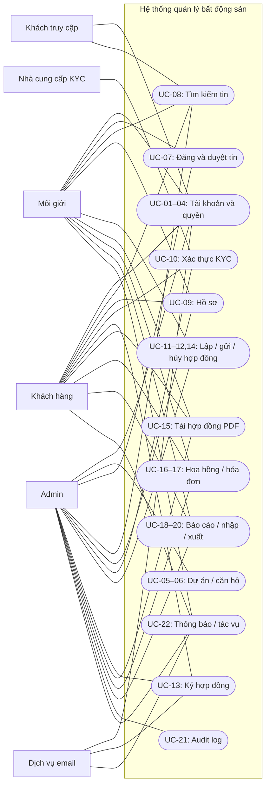
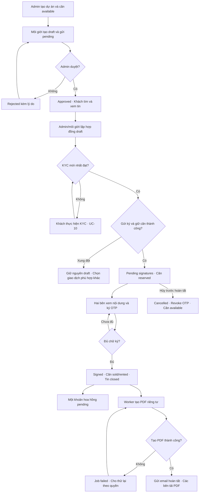

# USE CASES — Hệ thống quản lý bất động sản

| Thuộc tính | Nội dung |
| --- | --- |
| Phiên bản | 1.0 — đề xuất, 06/09/2026 |
| Căn cứ | [Yêu cầu gốc](yeu_cau.pdf), [PRD](PRD.md), [SPEC](SPEC.md), [ERD](ERD.md) |
| Trạng thái | Luồng mục tiêu cho MVP; dùng triển khai, viết test và demo |

## 1. Actor và quy ước

| Actor | Vai trò |
| --- | --- |
| Khách truy cập | Chưa đăng nhập; tìm kiếm tin công khai, đăng ký, đăng nhập, yêu cầu reset |
| Khách hàng | Quản lý hồ sơ/KYC của mình; xem, ký và tải hợp đồng; xem hóa đơn của mình |
| Môi giới | Quản lý tin và hợp đồng phụ trách; xem khách trong phạm vi, hoa hồng và báo cáo của mình |
| Admin | Quản lý tài khoản/danh mục, duyệt tin, quản lý giao dịch/chứng từ/hoa hồng, báo cáo/audit; ký đại diện nếu được chỉ định và có quyền |
| Nhà cung cấp KYC | Tiếp nhận xác thực danh tính và trả kết quả qua adapter |
| Dịch vụ email | Nhận email reset, lời mời, OTP và thông báo hoàn tất |

Worker, DB, Redis và kho tệp là thành phần nội bộ, không phải vai trò người dùng. Đăng nhập là tiền điều kiện của các use case riêng tư, không cần lặp lại bước đăng nhập trong mọi luồng. Quyền luôn bao gồm hành động và phạm vi bản ghi theo PRD/SPEC.

Mọi UC dưới đây thuộc P0, trừ 2FA đăng nhập được ghi riêng là P1. **Luồng chính** mô tả thành công; **ngoại lệ** chỉ rõ nhánh thay thế và dữ liệu được giữ lại. Mã FR/NFR lấy từ PRD, SP lấy từ SPEC. Chi tiết HTTP, validation và thời hạn OTP tuân SPEC.

## 2. Sơ đồ tổng quan

Sơ đồ Mermaid sau biểu diễn actor và nhóm use case, không phải sơ đồ UML include/extend đầy đủ. Đường nối biểu thị tham gia; quyền chi tiết được quy định trong từng UC.

Khách chỉ xem hóa đơn và xuất dữ liệu của mình trong nhóm MONEY/REPORT; không quản lý hoa hồng hoặc xem dashboard toàn hệ thống. Môi giới không có quyền duyệt tin, ghi nhận tiền hoặc ký đại diện mặc định.

## 3. Danh mục use case và truy vết

| UC | Tên | Actor chính | Yêu cầu |
| --- | --- | --- | --- |
| UC-01 | Đăng ký tài khoản khách hàng | Khách truy cập | FR-01, FR-02, SP-01 |
| UC-02 | Đăng nhập và đăng xuất | Người dùng | FR-01, FR-02, SP-01 |
| UC-03 | Đặt lại mật khẩu | Người dùng | FR-01, FR-15, SP-01/SP-07 |
| UC-04 | Quản lý tài khoản và vai trò | Admin | FR-02, FR-07, FR-16, SP-01 |
| UC-05 | Quản lý dự án | Admin | FR-03, FR-16, SP-02 |
| UC-06 | Quản lý căn hộ | Admin | FR-04, FR-16, SP-02 |
| UC-07 | Đăng, sửa và duyệt tin | Môi giới, Admin | FR-05, FR-16, SP-02 |
| UC-08 | Tìm kiếm và xem tin | Khách truy cập/khách hàng | FR-06, SP-02 |
| UC-09 | Quản lý và xem hồ sơ | Người dùng | FR-07, FR-02, SP-01 |
| UC-10 | Gửi và xử lý KYC | Khách hàng | FR-08, SP-03 |
| UC-11 | Lập và sửa hợp đồng nháp | Admin/môi giới | FR-09, FR-16, SP-04 |
| UC-12 | Gửi hợp đồng chờ ký | Admin/môi giới | FR-09, FR-15, SP-04 |
| UC-13 | Ký hợp đồng bằng OTP | Khách hàng/Admin đại diện | FR-09, FR-16, SP-04 |
| UC-14 | Hủy hợp đồng chưa hoàn tất | Admin/môi giới | FR-09, FR-16, SP-04 |
| UC-15 | Xem và tải hợp đồng PDF | Bên ký/môi giới/Admin | FR-10, FR-14, SP-04/SP-06 |
| UC-16 | Theo dõi, duyệt và ghi nhận chi hoa hồng | Admin/môi giới | FR-11, FR-16, SP-05 |
| UC-17 | Quản lý hóa đơn nội bộ | Admin | FR-17, FR-14, FR-16, SP-05 |
| UC-18 | Xem dashboard và báo cáo | Admin/môi giới | FR-12, SP-06 |
| UC-19 | Nhập dự án/căn hộ từ Excel/CSV | Admin | FR-13, SP-06 |
| UC-20 | Xuất dữ liệu và báo cáo | Người dùng có quyền | FR-13, FR-14, SP-06 |
| UC-21 | Tra cứu audit log | Admin có quyền | FR-16, SP-07 |
| UC-22 | Theo dõi thông báo và tác vụ nền | Người yêu cầu/Admin | FR-15, NFR-03/08, SP-07 |

## 4. Đặc tả use case

### UC-01 — Đăng ký tài khoản khách hàng

**Actor:** khách truy cập. **Kích hoạt:** chọn Đăng ký. **Tiền điều kiện:** dịch vụ tài khoản khả dụng.

**Luồng chính:**

1. Nhập tên, email, mật khẩu và xác nhận mật khẩu trên giao diện.
2. Hệ thống kiểm tra định dạng, chuẩn hóa email và kiểm tra trùng.
3. Hệ thống băm mật khẩu, tạo user + role customer + hồ sơ customer trong một giao dịch.
4. Hiển thị đăng ký thành công và chuyển tới đăng nhập.

**Ngoại lệ:** email trùng hoặc dữ liệu không hợp lệ thì báo lỗi trường, không tạo tài khoản dở dang. Client gửi role Admin/Môi giới bị từ chối; không tự cấp quyền. Lỗi DB rollback toàn bộ.

**Hậu điều kiện:** có đúng một tài khoản khách và hồ sơ tương ứng, không có quyền quản trị. **Nghiệm thu:** đăng ký email khác hoa/thường vẫn bị coi trùng; mật khẩu không xuất hiện trong response/log.

### UC-02 — Đăng nhập và đăng xuất

**Actor:** mọi người dùng có tài khoản. **Kích hoạt:** chọn Đăng nhập/Đăng xuất. **Tiền điều kiện:** tài khoản chưa xóa; đăng nhập yêu cầu active.

**Luồng chính:**

1. Người dùng nhập email và mật khẩu.
2. Hệ thống kiểm tra rate limit, thông tin đăng nhập và trạng thái tài khoản.
3. Cấp access token; giao diện tải thông tin/quyền và mở màn hình phù hợp.
4. Khi đăng xuất, hệ thống tăng auth_version để thu hồi các phiên của tài khoản, giao diện xóa token.

**Ngoại lệ:** sai thông tin trả thông báo chung; khóa tài khoản hoặc token hết hạn không được truy cập chức năng riêng tư; vượt giới hạn tạm chặn và thông báo thời gian thử lại. Nếu logout phía server lỗi, giao diện xóa token cục bộ nhưng không tuyên bố đã thu hồi mọi phiên.

**Hậu điều kiện:** đăng nhập có phiên hợp lệ; logout thành công vô hiệu JWT cũ. **Nghiệm thu:** gọi API trực tiếp bằng token cũ sau logout/khóa tài khoản bị từ chối.

### UC-03 — Đặt lại mật khẩu

**Actor:** người dùng quên mật khẩu; hỗ trợ: dịch vụ email. **Kích hoạt:** chọn Quên mật khẩu. **Tiền điều kiện:** người dùng truy cập được hộp thư nếu muốn hoàn tất.

**Luồng chính:**

1. Nhập email; hệ thống luôn hiện thông báo tiếp nhận giống nhau.
2. Nếu tài khoản hợp lệ, hệ thống tạo job gửi liên kết reset có hạn; worker chỉ lưu hash token, thu hồi liên kết trước.
3. Người dùng mở liên kết, nhập mật khẩu mới và xác nhận.
4. Hệ thống kiểm tra token, cập nhật hash mật khẩu, đánh dấu token đã dùng và thu hồi JWT cũ trong một giao dịch.
5. Người dùng đăng nhập lại bằng mật khẩu mới.

**Ngoại lệ:** email không tồn tại không gửi mail nhưng vẫn có thông báo chung; token sai/hết hạn/đã dùng yêu cầu xin liên kết mới. Email lỗi được retry theo UC-22, không lộ token trong log. Reset mật khẩu không tự mở khóa tài khoản bị Admin khóa.

**Hậu điều kiện:** chỉ mật khẩu mới dùng được; token reset không thể dùng lần hai. **Nghiệm thu:** hai request dùng cùng token đồng thời chỉ một request đổi mật khẩu thành công.

### UC-04 — Quản lý tài khoản và vai trò

**Actor:** Admin có quyền quản lý người dùng. **Kích hoạt:** mở quản lý tài khoản. **Tiền điều kiện:** phiên Admin hợp lệ.

**Luồng chính:**

1. Admin tìm kiếm/lọc tài khoản hoặc tạo tài khoản môi giới.
2. Chọn vai trò/trạng thái, xem đối tượng bị ảnh hưởng rồi xác nhận.
3. Hệ thống kiểm tra row_version; tạo hồ sơ agent/customer tương ứng nếu cấp role đó.
4. Lưu thay đổi, tăng auth_version và ghi audit trong transaction.
5. Hiển thị quyền/trạng thái mới.

**Ngoại lệ:** email/mã hồ sơ trùng, phiên bản cũ hoặc người thao tác không đủ quyền bị từ chối. Hồ sơ đã có giao dịch dùng lock/inactive thay xóa. Người bị thu hồi quyền không tiếp tục ký/xuất bằng token cũ.

**Hậu điều kiện:** role và hồ sơ nhất quán, có audit ai đổi quyền. **Nghiệm thu:** user tự sửa payload đăng ký/hồ sơ không thể cấp role; API kiểm tra lại quyền sau thay đổi.

### UC-05 — Quản lý dự án

**Actor:** Admin; môi giới có thể xem danh mục hoạt động. **Kích hoạt:** mở Dự án. **Tiền điều kiện:** có quyền tương ứng.

**Luồng chính:**

1. Xem danh sách có tìm kiếm, lọc, sắp xếp và phân trang.
2. Tạo dự án với mã, tên, địa chỉ, mã địa bàn và trạng thái.
3. Hệ thống validate, lưu và ghi audit; invalidate cache danh mục sau commit.
4. Khi sửa, Admin gửi dữ liệu cùng row_version; hệ thống trả bản cập nhật.
5. Khi xóa, Admin xác nhận; hệ thống kiểm tra phụ thuộc rồi xóa mềm.

**Ngoại lệ:** mã trùng, địa bàn sai, dữ liệu thiếu hoặc phiên bản cũ không được lưu. Dự án còn căn chưa xóa không được xóa; dự án có căn reserved không được chuyển inactive hoặc sửa thông tin ảnh hưởng hợp đồng chờ ký.

**Hậu điều kiện:** danh mục và cache phản ánh thay đổi; bản xóa không xuất hiện mặc định. **Nghiệm thu:** CRUD đúng quyền, tìm kiếm/phân trang ổn định và xóa bị chặn khi còn căn.

### UC-06 — Quản lý căn hộ

**Actor:** Admin. **Kích hoạt:** mở Căn hộ trong dự án. **Tiền điều kiện:** dự án tồn tại/chưa xóa.

**Luồng chính:**

1. Admin nhập mã căn, diện tích, số phòng và mô tả.
2. Hệ thống kiểm tra mã duy nhất trong dự án và số liệu hợp lệ; tạo căn available.
3. Admin xem/lọc danh sách hoặc sửa căn với row_version.
4. Khi yêu cầu xóa, hệ thống kiểm tra tin và hợp đồng liên quan, rồi xóa mềm và audit nếu được phép.

**Ngoại lệ:** diện tích <= 0, số phòng âm, mã trùng bị từ chối. Không xóa căn có tin chưa đóng hoặc hợp đồng đang chờ ký/đã ký; không sửa thủ công reserved/sold/rented; không sửa dữ liệu ảnh hưởng hợp đồng chờ ký.

**Hậu điều kiện:** căn gắn đúng dự án, lịch sử giao dịch không mất. **Nghiệm thu:** hai căn trong cùng dự án không có cùng mã; sửa trạng thái qua payload CRUD không vượt quy trình hợp đồng.

### UC-07 — Đăng, sửa và duyệt tin

**Actor:** môi giới phụ trách, Admin duyệt/quản lý. **Kích hoạt:** tạo tin bán/cho thuê. **Tiền điều kiện:** căn khả dụng, dự án active; môi giới active.

**Luồng chính:**

1. Môi giới chọn căn, loại sale/rent, giá/đơn vị và nội dung; lưu draft.
2. Môi giới gửi duyệt; hệ thống kiểm tra không có pending/approved khác của căn rồi chuyển pending.
3. Admin mở hàng chờ, xem thông tin và chọn duyệt.
4. Hệ thống kiểm tra lại căn, quyền và phiên bản, lưu approved/người duyệt/thời điểm/audit.
5. Tin xuất hiện ở tìm kiếm công khai.

**Luồng thay thế/ngoại lệ:** Admin từ chối phải nhập lý do, tin rejected; môi giới chuyển draft, sửa và gửi lại. Muốn sửa pending phải rút duyệt; sửa approved làm tin về draft và ngừng công khai. Khi có hợp đồng pending_signatures không sửa/đóng tin. Tin cạnh tranh cùng căn, phiên bản cũ, giá không đúng đơn vị hoặc truy cập tin môi giới khác bị chặn. Đóng approved không có hợp đồng chờ ký chuyển closed; không mở lại closed trong MVP.

**Hậu điều kiện:** tin có trạng thái và lịch sử duyệt rõ; chỉ approved đủ điều kiện được công khai. **Nghiệm thu:** hai request gửi duyệt cùng căn chỉ một pending/approved tồn tại.

### UC-08 — Tìm kiếm và xem tin

**Actor:** khách truy cập/khách hàng; Admin/môi giới cũng sử dụng được. **Kích hoạt:** mở trang tìm căn. **Tiền điều kiện:** không bắt buộc đăng nhập.

**Luồng chính:**

1. Người dùng chọn vị trí/dự án, loại bán hoặc thuê, khoảng giá và thứ tự sắp xếp.
2. Hệ thống validate bộ lọc, truy vấn tin approved của căn available và dự án active.
3. Trả danh sách, số kết quả và phân trang.
4. Người dùng mở chi tiết, xem nội dung công khai và giá đúng đơn vị.

**Ngoại lệ:** không có kết quả hiển thị trạng thái rỗng; khoảng giá sai hoặc lọc/sắp xếp giá không chọn loại giao dịch thì yêu cầu sửa bộ lọc. Tin đã bị đóng/giữ căn giữa lúc xem danh sách và mở chi tiết không còn khả dụng, trả thông báo phù hợp.

**Hậu điều kiện:** không thay đổi dữ liệu nghiệp vụ. **Nghiệm thu:** biết UUID tin draft vẫn không đọc được qua public API; không trả dữ liệu khách/KYC/hoa hồng.

### UC-09 — Quản lý và xem hồ sơ

**Actor:** khách hàng/môi giới sửa hồ sơ mình; Admin quản lý; môi giới xem khách trong giao dịch phụ trách. **Kích hoạt:** mở Hồ sơ. **Tiền điều kiện:** đăng nhập và có scope.

**Luồng chính:**

1. Người dùng mở hồ sơ được phép xem.
2. Nếu có quyền sửa, cập nhật tên, điện thoại/địa chỉ cho phép cùng row_version.
3. Hệ thống lưu thay đổi và audit, trả hồ sơ đã cập nhật.
4. Môi giới xem thông tin liên hệ cần thiết và trạng thái KYC của khách gắn giao dịch của mình.

**Ngoại lệ:** sửa role/email/trạng thái KYC qua hồ sơ bị từ chối; UUID khách ngoài scope không truy cập được. Với khách mới chưa có quan hệ giao dịch, Admin khởi tạo hợp đồng nháp gắn môi giới theo SPEC, không mở quyền dò toàn bộ khách.

**Hậu điều kiện:** hồ sơ hiện tại thay đổi nhưng snapshot hợp đồng cũ giữ nguyên. **Nghiệm thu:** môi giới không tải được giấy tờ KYC thô, khách không xem được hồ sơ người khác.

### UC-10 — Gửi và xử lý KYC

**Actor:** khách hàng; hỗ trợ: nhà cung cấp KYC, Admin có quyền chuyên biệt. **Kích hoạt:** chọn Xác thực danh tính. **Tiền điều kiện:** có hồ sơ customer, không có yêu cầu pending khác.

**Luồng chính:**

1. Khách gửi thông tin/tệp định danh của mình.
2. Hệ thống kiểm tra tệp, tạo yêu cầu pending và chuyển qua adapter.
3. Nhà cung cấp trả kết quả; hệ thống xác thực callback và ghép đúng request.
4. Nếu đạt, lưu verified, thời điểm/hạn nếu có và audit.
5. Khách xem trạng thái mới; các luồng gửi/ký hợp đồng sử dụng yêu cầu mới nhất.

**Luồng thay thế/ngoại lệ:** không đạt chuyển rejected kèm lý do phù hợp; lỗi kỹ thuật chuyển failed sau đối soát theo SPEC, không được coi là đạt. Người dùng gửi lại tạo yêu cầu mới. Callback lặp không tạo thêm kết quả; callback giả, cũ hoặc mâu thuẫn không ghi đè. Admin/nhà cung cấp có thể thu hồi verified thành rejected qua luồng riêng có audit. Demo hiển thị nhãn và không cho khách tự duyệt.

**Hậu điều kiện:** có lịch sử từng lần KYC và trạng thái hiện tại rõ ràng. **Nghiệm thu:** KYC expired/rejected/pending không cho khách ký; thu hồi sau khi ký không xóa bằng chứng lịch sử.

### UC-11 — Lập và sửa hợp đồng nháp

**Actor:** Admin hoặc môi giới phụ trách. **Kích hoạt:** chọn Lập hợp đồng từ tin. **Tiền điều kiện:** tin approved, căn available, khách trong scope và có hồ sơ; có Admin đại diện đủ quyền.

**Luồng chính:**

1. Chọn khách, đại diện ký, nhập giá trị/điều khoản, ngày thuê nếu rent và thông tin hoa hồng nội bộ.
2. Hệ thống lấy căn/môi giới/loại giao dịch từ tin, kiểm tra hai người ký khác nhau và dữ liệu hợp lệ.
3. Tạo contract draft, version đầu tiên, snapshot và đúng hai party trong transaction.
4. Người lập xem lại; sửa nháp tạo version mới, giữ bản cũ.
5. Khách xem phần nội dung hợp đồng dành cho mình, không nhận thông tin hoa hồng nội bộ.

**Ngoại lệ:** tin hết khả dụng, khách ngoài scope, ngày thuê sai, số tiền/tỷ lệ sai, hai bên cùng tài khoản hoặc version cũ bị từ chối. Khi gửi ký rồi, không sửa nháp; cần UC-14 rồi tạo hợp đồng mới. Khách chưa KYC đạt vẫn có thể có draft, nhưng không được gửi ký.

**Hậu điều kiện:** có hợp đồng nháp nhất quán và lịch sử phiên bản; căn vẫn available. **Nghiệm thu:** cập nhật hồ sơ/tin sau này không thay nội dung phiên bản cũ; version_no không trùng khi sửa cạnh tranh.

### UC-12 — Gửi hợp đồng chờ ký

**Actor:** Admin hoặc môi giới phụ trách. **Kích hoạt:** chọn Gửi ký. **Tiền điều kiện:** draft có hai bên hợp lệ, phiên bản mới nhất, KYC khách đạt/chưa hết hạn, căn available.

**Luồng chính:**

1. Người lập xem phiên bản sẽ gửi và xác nhận.
2. Hệ thống khóa/kiểm tra lại quyền, version, KYC, tin và căn.
3. Trong transaction, đóng băng version, chuyển contract pending_signatures và căn reserved; tạo audit/jobs/outbox mời ký.
4. Sau commit, worker gửi email tới hai bên; UI hiển thị chờ ký.

**Ngoại lệ:** căn bị hợp đồng khác giữ, KYC không còn đạt, đại diện mất quyền hoặc version cũ thì rollback toàn bộ. Email lỗi vẫn giữ hợp đồng chờ ký và có trạng thái retry; không giải phóng căn chỉ vì email lỗi. Lệnh gửi lặp không giữ căn hoặc gửi sự kiện nghiệp vụ lần hai.

**Hậu điều kiện:** một hợp đồng giữ căn, phiên bản/bên ký bị đóng băng. **Nghiệm thu:** hai hợp đồng gửi đồng thời chỉ một thành công, không có trường hợp căn reserved nhưng hợp đồng vẫn draft.

### UC-13 — Ký hợp đồng bằng OTP

**Actor:** khách hàng được chỉ định hoặc Admin đại diện được chỉ định; hỗ trợ: dịch vụ email. **Kích hoạt:** mở yêu cầu ký. **Tiền điều kiện:** pending_signatures, phiên bản frozen, actor đúng party và chưa ký; khách có KYC hợp lệ.

**Luồng chính:**

1. Người ký đăng nhập, xem toàn bộ signed_document của phiên bản và chọn nhận OTP.
2. Hệ thống tiếp nhận job; worker tạo challenge gắn party/hash và gửi OTP email.
3. Người ký nhập OTP, xác nhận đồng ý nội dung phiên bản.
4. Hệ thống kiểm tra chủ thể/quyền/KYC nếu là khách, hash, challenge, hạn và số lần thử.
5. Ghi chữ ký và dùng challenge trong transaction. Nếu mới một bên ký, hợp đồng vẫn chờ bên còn lại.
6. Khi đủ hai bên, hệ thống nguyên tử chuyển signed, căn sold/rented, đóng tin, tạo commission pending và job PDF/email.
7. UI hiển thị đã ký, cùng trạng thái tài liệu; email hoàn tất có liên kết tải sau khi PDF ready.

**Luồng thay thế/ngoại lệ:** OTP sai tăng bộ đếm; hết hạn/đã revoke cần mã mới; vượt 5 lần thử bị khóa challenge. Gửi lại OTP revoke mã cũ và chịu rate limit. Sai user/hash/version, tài khoản bị khóa hoặc KYC khách không còn đạt không tạo chữ ký. Request trùng chữ ký đã lưu trả kết quả cũ sau kiểm tra actor/version/challenge, không ghi lần hai. Hủy hợp đồng cạnh tranh có thể làm lệnh ký nhận INVALID_STATE. PDF/mail lỗi không đảo chữ ký thành thất bại.

**Hậu điều kiện:** chữ ký bất biến gắn đúng nội dung; đủ hai bên thì giao dịch hoàn tất đúng một lần. **Nghiệm thu:** hai bên ký đồng thời tạo đúng hai signature, một commission và một job PDF; không có OTP trong log/payload lưu trữ.

### UC-14 — Hủy hợp đồng chưa hoàn tất

**Actor:** Admin hoặc môi giới phụ trách. **Kích hoạt:** chọn Hủy hợp đồng. **Tiền điều kiện:** draft hoặc pending_signatures, row_version hiện tại.

**Luồng chính:**

1. Nhập lý do, xem hợp đồng bị ảnh hưởng và xác nhận hủy.
2. Hệ thống khóa/kiểm tra trạng thái và quyền.
3. Ghi cancelled/người/thời điểm/lý do; nếu đang giữ căn thì chuyển căn available; revoke OTP còn mở và ghi audit trong transaction.
4. Giữ lại các chữ ký đã có, hiển thị hợp đồng đã hủy. Tin vẫn approved nếu đủ điều kiện; có thể lập hợp đồng mới.

**Ngoại lệ:** signed không được hủy; khách không có lệnh hủy trực tiếp; phiên bản cũ bị từ chối. Nếu chữ ký cuối đã commit trước, hủy thất bại; nếu hủy thắng, ký thất bại. Bản cancelled có chữ ký không được xóa mềm.

**Hậu điều kiện:** hợp đồng không nhận chữ ký mới, căn được giải phóng nếu trước đó do hợp đồng này giữ. **Nghiệm thu:** không giải phóng căn của hợp đồng khác; lịch sử xác nhận vẫn tra cứu được.

### UC-15 — Xem và tải hợp đồng PDF

**Actor:** hai bên hợp đồng, môi giới phụ trách, Admin có quyền. **Kích hoạt:** chọn Tải hợp đồng. **Tiền điều kiện:** actor có scope; PDF của phiên bản signed đã ready để tải.

**Luồng chính:**

1. Mở chi tiết hợp đồng và xem trạng thái tạo PDF.
2. Khi ready, yêu cầu tải tài liệu.
3. Hệ thống kiểm tra lại quyền theo hợp đồng, tham chiếu file/purpose và trạng thái ready.
4. Trả PDF từ kho riêng tư; nội dung lấy từ frozen signed_document và bằng chứng ký.

**Ngoại lệ:** pending/running hiển thị đang tạo; failed hiển thị lỗi đã làm sạch và cho actor có quyền retry job tạm lỗi qua UC-22. Mất quyền hoặc UUID của người khác bị từ chối. Storage lỗi không làm mất chữ ký/hợp đồng; không trả đường dẫn nội bộ.

**Hậu điều kiện:** nhận đúng tài liệu, không thay đổi nội dung đã ký. **Nghiệm thu:** PDF không có hoa hồng nội bộ hoặc dữ liệu KYC thô; hash byte khớp metadata; đổi hồ sơ không đổi nội dung hợp đồng cũ.

### UC-16 — Theo dõi, duyệt và ghi nhận chi hoa hồng

**Actor:** Admin quản lý; môi giới xem của mình. **Kích hoạt:** hợp đồng ký đủ hoặc mở Hoa hồng. **Tiền điều kiện:** khoản pending đã được hệ thống tạo từ hợp đồng signed.

**Luồng chính:**

1. Môi giới/Admin xem danh sách, cơ sở tính, tỷ lệ, số tiền và trạng thái trong scope.
2. Admin kiểm tra khoản pending rồi duyệt thành approved.
3. Sau khi chi bên ngoài hệ thống, Admin nhập tham chiếu và xác nhận paid.
4. Hệ thống kiểm tra quyền/version, lưu người/thời điểm chi và audit.

**Ngoại lệ:** pending/approved có thể cancelled với lý do; paid/cancelled không sửa lại trong MVP. Không sửa công thức/số tiền snapshot sau tạo. Gửi lại ghi nhận chi không tạo giao dịch thứ hai; tham chiếu khác xung đột bị từ chối. Khách không truy cập dữ liệu hoa hồng.

**Hậu điều kiện:** có trạng thái và bằng chứng ghi nhận chi, không chuyển tiền tự động. **Nghiệm thu:** cùng hợp đồng không có hai khoản commission; tính/round đúng ví dụ trong SPEC.

### UC-17 — Quản lý hóa đơn nội bộ

**Actor:** Admin thao tác; khách/môi giới xem hóa đơn hợp đồng trong scope. **Kích hoạt:** tạo hóa đơn từ hợp đồng. **Tiền điều kiện:** hợp đồng signed.

**Luồng chính:**

1. Admin nhập mã chứng từ, số tiền và ngày đến hạn nếu có; tạo draft.
2. Admin kiểm tra/sửa draft rồi phát hành thành issued; hệ thống đóng băng nội dung và tạo job PDF.
3. Khách/môi giới có quyền xem/tải chứng từ.
4. Sau thanh toán ngoài hệ thống, Admin nhập tham chiếu và xác nhận paid toàn bộ.
5. Hệ thống lưu người/thời điểm và audit; không tự đổi hoa hồng sang paid.

**Ngoại lệ:** mã trùng, số tiền <= 0 hoặc hợp đồng chưa signed bị chặn. Chứng từ draft/issued sai có thể void với lý do rồi lập mới; issued không sửa nội dung, paid không void trong MVP. Lỗi PDF xử lý qua job, không hủy trạng thái issued. Không nhận thanh toán từng phần.

**Hậu điều kiện:** chứng từ có vòng đời và lịch sử rõ; đây là hóa đơn nội bộ. **Nghiệm thu:** gọi pay lặp không ghi nhận lần hai; bên ngoài hợp đồng không xem/tải được.

### UC-18 — Xem dashboard và báo cáo

**Actor:** Admin hoặc môi giới. **Kích hoạt:** mở Dashboard. **Tiền điều kiện:** có quyền báo cáo trong scope.

**Luồng chính:**

1. Chọn khoảng ngày Việt Nam và bộ lọc được phép.
2. Hệ thống xác định scope và đổi thời gian sang UTC.
3. Tổng hợp số tin/số hợp đồng theo ngày tạo và trạng thái hiện tại; số hợp đồng ký theo signed_at; hoa hồng theo định nghĩa PRD.
4. Hiển thị chỉ số, biểu đồ/bảng, bộ lọc và thời điểm cập nhật.

**Ngoại lệ:** khoảng ngày sai yêu cầu sửa; không có dữ liệu hiển thị 0/trạng thái rỗng. Môi giới không mở rộng scope qua query parameter. Cache tối đa 60 giây và không dùng nhầm dữ liệu/quyền Admin.

**Hậu điều kiện:** không thay đổi dữ liệu nghiệp vụ. **Nghiệm thu:** dữ liệu ở ranh giới ngày Việt Nam được tính đúng, join nhiều hóa đơn không làm tăng số hợp đồng.

### UC-19 — Nhập dự án/căn hộ từ Excel hoặc CSV

**Actor:** Admin. **Kích hoạt:** chọn Nhập dữ liệu. **Tiền điều kiện:** file theo mẫu, các dự án tham chiếu đã tồn tại khi nhập căn.

**Luồng chính:**

1. Tải mẫu, điền dữ liệu và upload `.xlsx`/`.csv` trong giới hạn SPEC.
2. Hệ thống kiểm tra tệp/quyền, tạo job nhập và trả mã theo dõi.
3. Worker kiểm tra toàn bộ dòng, kiểu dữ liệu, mã trùng và FK.
4. Nếu hợp lệ, ghi tất cả bản ghi mới trong một transaction, lưu kết quả job/audit và invalidate cache.
5. Admin xem tổng dòng đã nhập.

**Ngoại lệ:** file quá lớn/sai loại, macro/công thức hoặc giải nén vượt giới hạn bị chặn. Một dòng sai làm toàn bộ dữ liệu nghiệp vụ không được nhập; trả dòng/cột/mã lỗi để sửa. Mã phát sinh trùng sau validation khiến transaction rollback. Retry job đã thành công không nhập lần hai; mất quyền trước xử lý làm job thất bại.

**Hậu điều kiện:** toàn bộ dữ liệu hợp lệ được tạo mới hoặc không có bản ghi nghiệp vụ nào được thêm; file/job lỗi vẫn có thể tồn tại để theo dõi. **Nghiệm thu:** không upsert âm thầm; test một dòng lỗi trong file nhiều dòng chứng minh rollback.

### UC-20 — Xuất dữ liệu và báo cáo

**Actor:** Admin/môi giới theo scope; khách chỉ xuất dữ liệu mình được phép. **Kích hoạt:** chọn Xuất Excel/CSV/PDF. **Tiền điều kiện:** có quyền với loại dữ liệu và định dạng tương ứng.

**Luồng chính:**

1. Người dùng chọn bộ lọc và định dạng; hệ thống hiển thị phạm vi sẽ xuất.
2. Hệ thống tạo job/outbox chứa actor, phạm vi và bộ lọc; trả mã theo dõi.
3. Worker kiểm tra lại quyền, đọc dữ liệu nhất quán tại lúc xử lý và tạo tệp private.
4. Job succeeded lưu output_file_id; UI hiển thị tải xuống.
5. Khi tải, hệ thống kiểm tra quyền hiện tại trước khi trả tệp.

**Ngoại lệ:** sai định dạng/bộ lọc bị chặn; mất quyền khi job chạy thì failed. Quyền bị thu hẹp sau xuất thì chặn tệp cũ và yêu cầu xuất lại. Lỗi tạo/upload tệp cho retry theo UC-22. Không có dữ liệu vẫn có tệp hợp lệ chỉ chứa tiêu đề hoặc thông báo không có dữ liệu.

**Hậu điều kiện:** tệp chứa đúng scope/cột cho phép, có generated_at và bộ lọc; không thay đổi nghiệp vụ. **Nghiệm thu:** không lộ hoa hồng cho khách, secret/KYC thô; ô có ký tự công thức được xuất dạng text.

### UC-21 — Tra cứu audit log

**Actor:** Admin có quyền audit. **Kích hoạt:** mở Nhật ký hoạt động. **Tiền điều kiện:** phiên hợp lệ và quyền chuyên biệt.

**Luồng chính:**

1. Lọc theo actor, loại/ID đối tượng, hành động và thời gian.
2. Hệ thống kiểm tra quyền, trả danh sách phân trang.
3. Admin xem ai làm gì, lúc nào, đối tượng, request ID và thay đổi đã làm sạch.

**Ngoại lệ:** actor hệ thống hiển thị system, không giả người dùng; không có kết quả hiển thị rỗng; người không có quyền bị từ chối. Không cung cấp sửa/xóa audit qua API.

**Hậu điều kiện:** audit không bị thay đổi. **Nghiệm thu:** duyệt tin/ký/hủy/ghi nhận tiền có audit cùng transaction; log không chứa password/token/OTP/giấy tờ KYC thô.

### UC-22 — Theo dõi thông báo và tác vụ nền

**Actor:** người yêu cầu job hoặc Admin có quyền; hỗ trợ: dịch vụ email. **Kích hoạt:** thao tác phát sinh job hoặc mở trạng thái job. **Tiền điều kiện:** job đã commit, actor có scope nếu xem/retry.

**Luồng chính:**

1. Hệ thống trả job pending; dispatcher chuyển công việc qua hàng đợi.
2. Worker nhận job, đánh dấu running, thực hiện gửi mail/tạo tệp/nhập dữ liệu.
3. Khi thành công, cập nhật succeeded và kết quả; email lưu trạng thái gửi.
4. Người dùng theo dõi trạng thái; nếu job tạm lỗi và còn ngân sách, hệ thống retry theo SPEC.
5. Khi hết lượt, hiển thị failed/error đã làm sạch; actor được phép chọn thử lại lỗi có thể phục hồi.

**Ngoại lệ:** Redis lỗi sau commit vẫn còn outbox để phát lại; worker chết được đối soát. Job lặp không lặp giao dịch nghiệp vụ. SMTP timeout có thể gửi email trùng; không cam kết email đúng một lần. Job reset của email chưa xác thực không công khai trạng thái để dò tài khoản; job hệ thống chỉ Admin được xem.

**Hậu điều kiện:** trạng thái bền vững, kết quả hoặc lỗi có thể theo dõi; giao dịch đã ký không rollback khi email/PDF lỗi. **Nghiệm thu:** giả lập mất broker/worker, phục hồi được job mà không sinh thêm hoa hồng/hợp đồng.

## 5. Luồng xuyên suốt đăng tin → ký hợp đồng

Sơ đồ lược bỏ chi tiết retry OTP/KYC, được quy định tại UC-10/UC-13. OTP lỗi không tự chuyển hợp đồng về draft; hủy trước đủ chữ ký theo UC-14. Thuê trong MVP kết thúc luồng ở rented, chưa có tự giải phóng căn khi hết kỳ.

## 6. Bộ kịch bản nghiệm thu/demo

| Kịch bản | Dữ liệu/điều kiện | Kết quả mong đợi |
| --- | --- | --- |
| E2E-01 — Bán căn | Admin, môi giới, khách khác tài khoản; tin sale approved; KYC đạt | UC-11–UC-15 hoàn tất, căn sold, một hoa hồng, PDF tải đúng quyền |
| E2E-02 — Thuê căn | Tin rent/month, tổng giá trị và khoảng thuê rõ | Căn rented, hợp đồng giữ đúng giá trị và ngày; không tự kết thúc thuê |
| E2E-03 — Duyệt lại | Tin bị từ chối hoặc tin approved được sửa | Quay draft/pending trước khi approved; không public nội dung chưa duyệt |
| E2E-04 — KYC lỗi | Callback lỗi/giả/lặp, KYC chưa đạt/hết hạn | Không ký trái điều kiện, lịch sử lần xác thực được giữ |
| E2E-05 — Cạnh tranh | Hai draft cùng căn; hai bên ký hoặc ký/hủy đồng thời | Một lần giữ căn, một lần hoàn tất, không trạng thái dở dang |
| E2E-06 — Phân quyền | Khách A dùng UUID của khách B; môi giới xem giao dịch người khác | Không xem/sửa/tải/export ngoài scope |
| E2E-07 — Job lỗi | Broker/SMTP/storage bị gián đoạn sau commit | Có trạng thái lỗi/đối soát/retry, không mất chữ ký hoặc nhân đôi hoa hồng |
| E2E-08 — Nhập/xuất/báo cáo | File có một dòng sai; dữ liệu ở ranh giới ngày; role thay đổi giữa export | Import rollback, chỉ số đúng, tệp không lộ scope cũ |
| E2E-09 — Tiền và audit | Gửi lại pay/approve; thay đổi phiên bản cũ | Không ghi nhận tiền hai lần; xung đột bị chặn; audit đúng actor |

NFR về hiệu năng, coverage, Docker/CI và log được kiểm chứng theo SP-08 trong SPEC, không phải use case người dùng riêng. Các kịch bản trên là kế hoạch, chưa phải kết quả test đã chạy.

## 7. Phần mở rộng chưa thuộc MVP

FR-18 (P1) là bật/tắt và khôi phục 2FA cho đăng nhập. Khi chọn triển khai cần đặc tả use case, schema secret/recovery code và test riêng; OTP ký ở UC-13 không được tính là hoàn thành 2FA đăng nhập. Các yêu cầu chữ ký số nhà cung cấp, thanh toán online, Manager riêng, nhiều bên ký và kết thúc/gia hạn thuê giữ trạng thái ngoài phạm vi theo PRD.
